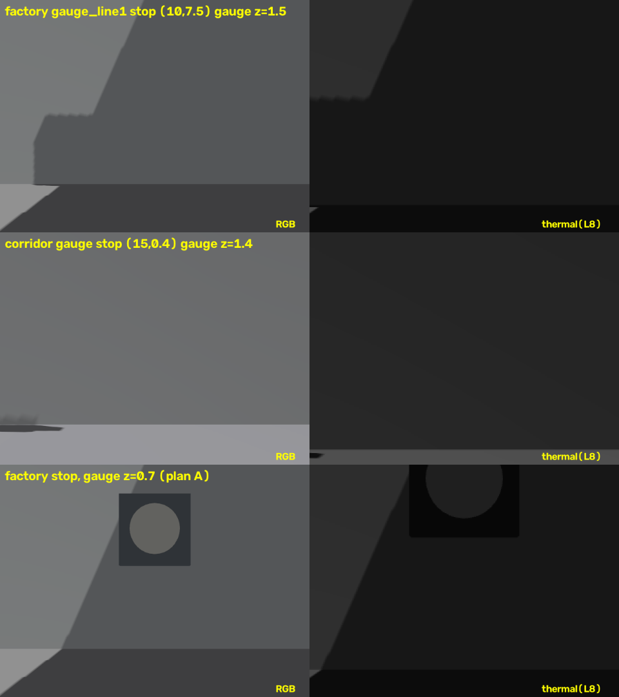

# gauge_ocr 학습 내용 정리 (운학)

[STUDY_PLAN.md](STUDY_PLAN.md) 8절 학습 순서의 항목별 학습 내용을 기록한다.
이 패키지의 실제 코드(`gauge_ocr/gauge_ocr_node.py`, `launch/gauge_ocr.launch.py`)를 예제로 삼는다.

---

## 0. 실행 환경 — macOS + Docker + Gazebo 확인 창구

STUDY_PLAN 2.5·2.6절의 배경 정리. 2026-09-14 기준.

### 0.1 왜 Docker인가

| 구분 | 내용 |
|------|------|
| 내 머신 | macOS 26 (Apple Silicon, arm64) |
| 문제 | ROS 2 Jazzy는 macOS를 Tier 3로만 지원 → 바이너리 없음, 소스 빌드. Nav2, `ros_gz`, `cv_bridge`, `gz_ros2_control`, `foxglove_bridge`, `rosbridge`는 Mac 빌드 자체가 없음 |
| Gazebo 단독 | Gazebo Harmonic은 `brew`로 Mac 네이티브 설치가 되지만, 이 프로젝트는 ROS 브리지·Nav2와 함께 써야 하므로 의미 없음 |
| 결론 | Ubuntu 환경이 필요 → Mac에서 가장 가벼운 방법이 **Docker**. 부수 효과로 팀원·평가자가 `docker compose up` 한 번에 같은 환경을 얻는다(재현성) |

대안 비교:
- Ubuntu 네이티브 PC / 듀얼부팅: 성능 최고, 장비 필요.
- UTM·Parallels VM에 Ubuntu 24.04 arm64: GUI 편하지만 Docker보다 무겁고 재현성 낮음.
- 클라우드(EC2): 이전 프로젝트는 보너스 RL 학습에만 사용.

### 0.2 이전 프로젝트(`plant-robot-digital-twin`)에서 검증된 것

- `osrf/ros:humble-desktop`은 amd64 전용 → Apple Silicon에서 에뮬레이션, 빈 월드 RTF ≈ 0.5.
- Humble arm64 저장소에는 Gazebo Classic도 `ros-gz-sim`도 없음.
- **Jazzy + Gazebo Harmonic은 arm64 네이티브로 전체 스택 제공** (`ros-gz-sim`, `gz-ros2-control`, Nav2, Foxglove, rosbridge) → 채택. 이 프로젝트도 같은 조합.
- 베이스는 `ros:jazzy` 공식 이미지에 필요한 apt 패키지를 직접 얹는 방식. `LIBGL_ALWAYS_SOFTWARE=1`, `QT_X11_NO_MITSHM=1` 환경변수 사용.
- 참고 파일: `plant-robot-digital-twin/docker/Dockerfile`, `docker/docker-compose.yml`, `docker/smoke_test.sh`.

### 0.3 현재 저장소 Dockerfile·README에서 고칠 점

| 항목 | 현재 | 문제 | 조치 |
|------|------|------|------|
| 베이스 이미지 | `osrf/ros:jazzy-desktop` | arm64 태그 여부 미확인 (`docker manifest inspect`가 이 네트워크에서 실패) | 빌드 후 `uname -m`이 `aarch64`인지 확인. 아니면 `ros:jazzy`로 교체 |
| 소스 반영 | `COPY . /workspace` | 이미지 빌드 시점 스냅샷. 호스트에서 편집해도 반영 안 됨 | `-v $PWD:/workspace` 마운트 + 컨테이너 안 `colcon build --symlink-install` |
| 실행 방식 | `--network host`, `-v /tmp/.X11-unix` | Linux 전용. Mac에는 X11 소켓이 없고 host 네트워크도 동작이 다름 | `-p 8765:8765 -p 9090:9090`로 포트 명시, GUI는 0.4절 방식 |
| 의존성 | cv_bridge, message_filters, foxglove_bridge, rosbridge 없음 | 이 패키지 실행 불가 | apt 목록에 추가 |
| 빌드 산출물 | `build/ install/ log/` | `.gitignore`에 이미 있음 | 마운트 방식이면 호스트 저장소 안에 생기지만 커밋되지 않음 |

### 0.4 Gazebo 화면을 보는 세 가지 방법

**① Foxglove Studio (평소 개발용, 권장)**

```bash
# 컨테이너 안
ros2 launch simulation full_system.launch.py world:=factory gui:=false   # gz sim -s -r (서버만)
ros2 launch foxglove_bridge foxglove_bridge_launch.xml                   # ws 8765
```

Mac 네이티브 Foxglove Studio 앱 → Open connection → `ws://localhost:8765`.
로봇 3D 모델·TF·`/camera/image`·`/thermal/image`·토픽 플롯을 Mac GPU로 렌더링하므로 빠르고 안정적.
단점: Gazebo 월드(벽·계단 메쉬)는 안 보인다. ROS 토픽으로 나오는 것만 보임.

**② noVNC (진짜 Gazebo GUI가 필요할 때)**

- compose에 `theasp/novnc` 컨테이너를 추가하고 sim 컨테이너에 `DISPLAY=novnc:0.0`을 준다.
- 컨테이너 셸에서 `gz sim -g` 실행 → 브라우저 `http://localhost:8080/vnc.html`.
- 소프트웨어 렌더링(Mesa) + noVNC 이미지가 amd64라 에뮬레이션까지 겹쳐 느리다. 월드 배치 확인·스크린샷 용도로만.
- `rqt_image_view`도 X 창이 필요하므로 이 안에서만 뜬다.
- 루트 README의 대시보드가 같은 8080을 쓰므로 둘 중 하나는 포트를 바꾼다.

**③ 관제 대시보드 (시연·보고서 캡처)**

`rosbridge_server`(9090) → 브라우저에서 `monitoring/web`. 수현 담당.

XQuartz X11 포워딩은 Gazebo OGRE2와 궁합이 나빠 이전 프로젝트에서 noVNC로 대체했다.
Gazebo GUI 클라이언트만 Mac에 `brew`로 깔아 컨테이너 서버에 붙이는 방법은 gz-transport 멀티캐스트 발견이 Docker Desktop 네트워크를 못 넘어 실용적이지 않다.

### 0.5 헤드리스에서 카메라 센서가 도는 이유

`gui:=false`는 `gz sim -s -r`(서버 전용)이지만, 카메라 센서 렌더링은 서버 쪽 sensors 시스템(OGRE2)이 담당하므로 GUI 없이도 `/camera/image`, `/thermal/image`가 나온다.
GPU가 없으니 `LIBGL_ALWAYS_SOFTWARE=1`로 Mesa CPU 렌더링을 쓴다. RGB 640×480@15 Hz + 열화상 320×240@10 Hz를 CPU로 그리면 RTF가 떨어질 수 있으니 `ros2 topic hz`와 Gazebo RTF를 함께 확인하고, 느리면 해상도·주기를 낮추는 것을 시뮬 담당과 상의한다.

### 0.6 정리

- Mac에서 ROS 2 스택을 쓰는 이상 Docker가 사실상 유일한 현실적 경로.
- 평소: headless + Foxglove. 월드 편집·물리 디버깅: noVNC. 시연: 대시보드.
- 다음 액션: 이전 프로젝트 compose 파일을 가져와 이 저장소 구조(`/workspace`, `full_system.launch.py`)에 맞게 수정.

---

## 1. ROS 2 Python 기초 — 노드·토픽·파라미터·런치

### 1.1 핵심 개념

| 용어 | 뜻 | 이 패키지에서 |
|------|-----|--------------|
| **노드(Node)** | 하나의 실행 단위(프로세스). 이름을 갖고 토픽·파라미터를 소유 | `gauge_ocr` 노드 하나 |
| **토픽(Topic)** | 이름 붙은 데이터 통로. 발행자(publisher)가 쓰고 구독자(subscriber)가 읽음. N:M 가능 | 구독 `/camera/image`, 발행 `/inspection/gauge` |
| **메시지(Message)** | 토픽으로 오가는 데이터의 타입. `패키지/msg/이름` 형식 | `sensor_msgs/msg/Image`, `std_msgs/msg/Float32` |
| **파라미터(Parameter)** | 노드가 갖는 설정값. 런치·YAML·CLI로 바꿀 수 있음 | `world`, 앞으로 추가할 임계값들 |
| **런치(Launch)** | 여러 노드를 인자·파라미터와 함께 한 번에 띄우는 파이썬 스크립트 | `launch/gauge_ocr.launch.py` |
| **패키지(Package)** | 빌드·배포 단위. `package.xml` + `setup.py`(파이썬) | `gauge_ocr` |
| **워크스페이스** | 패키지들을 모아 `colcon build` 하는 디렉터리 | 저장소 루트 |
| **서비스/액션** | 요청-응답형 통신. 이 패키지에서는 당장 안 씀 | — |

토픽 이름의 슬래시는 네임스페이스 구분자다. `/inspection/gauge`는 "inspection 그룹의 gauge 토픽"이라는 뜻이며 폴더와 무관하다 (STUDY_PLAN.md 1절 참고).

### 1.2 워크스페이스와 빌드

```bash
source /opt/ros/jazzy/setup.bash          # ROS 환경 (터미널마다)
cd <저장소 루트>
colcon build --symlink-install --packages-select gauge_ocr
source install/setup.bash                 # 빌드 결과 환경 (빌드 후마다)
```

- `--symlink-install`: 파이썬 파일을 복사하지 않고 링크 → 코드 수정 후 재빌드 없이 바로 실행 반영. 단 `setup.py`·`package.xml`·`data_files`(launch, config)를 바꾸면 다시 빌드해야 한다.
- `--packages-select`: 해당 패키지만 빌드. 전체 빌드는 오래 걸린다.
- 빌드 산출물은 `build/`, `install/`, `log/`에 생기고 `.gitignore`에 들어가 있어야 한다.

패키지 구조:

```
gauge_ocr/
  package.xml          # 이름, 버전, 의존성 (apt/rosdep이 읽음)
  setup.py             # 파이썬 패키징 + 설치할 파일(data_files) + 실행 진입점(entry_points)
  setup.cfg            # 스크립트 설치 위치
  resource/gauge_ocr   # ament 인덱스 마커 (빈 파일, 건드리지 않음)
  gauge_ocr/           # 실제 파이썬 모듈
    __init__.py
    gauge_ocr_node.py
  launch/gauge_ocr.launch.py
```

`setup.py`의 `entry_points`에서 `gauge_ocr_node = gauge_ocr.gauge_ocr_node:main`이 `ros2 run gauge_ocr gauge_ocr_node` 명령을 만든다. 파일을 추가하면 모듈이 자동 포함되지만(`find_packages`), 새 실행 파일을 만들려면 여기에 추가해야 한다.

### 1.3 노드 구조 (현재 코드 해설)

```python
import rclpy
from rclpy.node import Node
from sensor_msgs.msg import Image
from std_msgs.msg import Float32


class GaugeOcrNode(Node):
    def __init__(self) -> None:
        super().__init__("gauge_ocr")                       # 노드 이름
        self.create_subscription(Image, "/camera/image", self.camera_image_cb, 10)
        self.pub_0 = self.create_publisher(Float32, "/inspection/gauge", 10)
        self.create_timer(0.5, self._tick)                  # 0.5 s 주기 콜백
        self.get_logger().info("gauge_ocr started (운학)")

    def camera_image_cb(self, msg: Image) -> None:          # 이미지가 올 때마다 호출
        del msg

    def _tick(self) -> None:                                # 타이머 콜백
        out = Float32(); out.data = 0.0; self.pub_0.publish(out)


def main(args=None) -> None:
    rclpy.init(args=args)      # ROS 통신 초기화
    node = GaugeOcrNode()
    rclpy.spin(node)           # 콜백을 돌리며 블로킹. Ctrl+C까지
    node.destroy_node()
    rclpy.shutdown()
```

알아둘 점:
- `create_subscription(타입, 토픽, 콜백, QoS)`: 마지막 인자 `10`은 큐 깊이(depth)만 준 축약형 QoS다.
- `create_publisher(타입, 토픽, QoS)` → `.publish(msg)`.
- `spin`은 **단일 스레드**로 콜백을 순서대로 실행한다. 이미지 콜백에서 무거운 처리를 하면 다음 콜백이 밀린다. 콜백은 가볍게, 처리 결과는 멤버 변수에 저장하고 타이머에서 발행하는 구조가 안전하다.
- `self.get_logger().info/warn/error()`로 로그. `print`보다 이걸 쓴다.
- 이미지 구독과 발행이 분리돼 있어 현재는 "이미지가 안 와도 0.0을 계속 발행"한다. 실제 구현 시 "최근 판독값이 있을 때만 발행" 또는 "판독 즉시 발행"으로 바꿀지 결정.

### 1.4 메시지 타입 들여다보기

```bash
ros2 interface show sensor_msgs/msg/Image
ros2 interface show std_msgs/msg/Float32
```

`sensor_msgs/msg/Image` 주요 필드:

| 필드 | 뜻 |
|------|-----|
| `header.stamp` | 촬영 시각 (시뮬 시간) |
| `header.frame_id` | 카메라 좌표계 이름 (TF 연동 시 사용) |
| `height`, `width` | 480, 640 |
| `encoding` | `rgb8`, `bgr8`, `mono8`, `mono16` 등. Gazebo 카메라는 보통 `rgb8` |
| `step` | 한 행의 바이트 수 (= width × 채널 수) |
| `data` | 픽셀 바이트 배열. cv_bridge가 이걸 numpy로 바꿔준다 |

콜백에서 `msg.encoding`, `msg.width`를 로그로 찍어보는 게 첫 실습이다.

### 1.5 QoS (Quality of Service)

발행자와 구독자의 QoS가 호환되지 않으면 **연결 자체가 안 되고 에러도 안 난다**. 이미지가 안 들어오면 QoS부터 의심한다.

```python
from rclpy.qos import qos_profile_sensor_data

self.create_subscription(Image, "/camera/image", self.camera_image_cb, qos_profile_sensor_data)
```

- `qos_profile_sensor_data`: BEST_EFFORT + 작은 큐. 최신 프레임만 중요한 센서 데이터에 맞다.
- 기본 프로파일(`10`): RELIABLE. 발행자가 RELIABLE이면 구독자가 BEST_EFFORT여도 연결된다(반대는 안 됨). 그래서 센서 구독은 BEST_EFFORT가 안전하다.
- 확인: `ros2 topic info -v /camera/image` → 발행자·구독자 각각의 Reliability, Durability를 보여준다.

### 1.6 파라미터

선언 → 읽기 → (선택) 변경 콜백.

```python
self.declare_parameter("world", "corridor")
self.declare_parameter("alarm_max", 80.0)
world = self.get_parameter("world").get_parameter_value().string_value
alarm_max = self.get_parameter("alarm_max").value   # .value 축약형도 됨
```

- 선언하지 않은 파라미터를 런치에서 넘기면 **무시**된다. 현재 런치가 `world`를 넘기지만 노드가 선언하지 않아 아무 효과가 없는 상태다.
- 타입은 기본값에서 추론된다. `80.0`(float)로 선언했는데 `80`(int)을 넘기면 에러.
- 실행 중 바꾸기:

```bash
ros2 param list /gauge_ocr
ros2 param get /gauge_ocr alarm_max
ros2 param set /gauge_ocr alarm_max 90.0
```

- 실행 중 변경을 반영하려면 `self.add_on_set_parameters_callback(cb)`로 콜백을 달거나, 매 틱마다 `get_parameter`로 다시 읽는다. 임계값 튜닝에는 후자가 간단하다.
- YAML 파일로 묶어 넘기기 (`config/gauge_factory.yaml`):

```yaml
gauge_ocr:                # 노드 이름
  ros__parameters:
    alarm_max: 80.0
    needle_angle_min: 225.0
```

`setup.py`의 `data_files`에 `(os.path.join("share", package_name, "config"), glob("config/*.yaml"))`을 추가해야 설치된다 (patrol_path 패키지가 이미 이 방식을 쓰고 있으니 참고).

### 1.7 런치 파일 (현재 코드 해설)

```python
from launch import LaunchDescription
from launch.actions import DeclareLaunchArgument
from launch.substitutions import LaunchConfiguration
from launch_ros.actions import Node


def generate_launch_description() -> LaunchDescription:
    return LaunchDescription([
        DeclareLaunchArgument("world", default_value="corridor"),   # ros2 launch ... world:=factory
        Node(
            package="gauge_ocr",
            executable="gauge_ocr_node",        # setup.py entry_points 이름
            name="gauge_ocr",                   # 노드 이름 덮어쓰기
            output="screen",                    # 로그를 터미널로
            parameters=[{"world": LaunchConfiguration("world"), "use_sim_time": True}],
        ),
    ])
```

- `LaunchConfiguration("world")`는 런치 인자를 나중에 평가하는 치환자(substitution)다. 파이썬 문자열처럼 바로 쓸 수 없다.
- `use_sim_time: True`: 노드의 시계를 `/clock` 토픽(시뮬 시간)에 맞춘다. 이게 켜져 있으면 시뮬이 안 돌 때 `self.get_clock().now()`가 0에 머문다.
- YAML 파라미터 파일을 추가로 넘기려면 `parameters=[yaml_path, {...}]`처럼 리스트에 경로를 넣는다. 경로는 `get_package_share_directory("gauge_ocr")`로 얻는다.
- 통합 런치 `simulation/launch/full_system.launch.py`가 이 파일을 `IncludeLaunchDescription`으로 포함하고 `world`를 넘긴다. 즉 이 런치를 고치면 통합 실행에도 반영된다.

### 1.8 자주 쓰는 CLI

```bash
ros2 node list                       # 떠 있는 노드
ros2 node info /gauge_ocr            # 구독·발행·파라미터 목록
ros2 topic list                      # 토픽 목록
ros2 topic echo /inspection/gauge    # 값 확인
ros2 topic hz /camera/image          # 주기 (15 Hz 나와야 정상)
ros2 topic info -v /camera/image     # 발행자·구독자·QoS
ros2 param list /gauge_ocr
ros2 interface show sensor_msgs/msg/Image
ros2 run gauge_ocr gauge_ocr_node    # 런치 없이 노드만
ros2 launch gauge_ocr gauge_ocr.launch.py world:=factory
```

### 1.9 실습 체크리스트

- [ ] 패키지 단독 빌드 후 `ros2 run gauge_ocr gauge_ocr_node` 실행, 다른 터미널에서 `ros2 topic echo /inspection/gauge`로 0.0 확인
- [ ] 시뮬 기동 후 `ros2 topic hz /camera/image`로 15 Hz 확인, `ros2 topic info -v`로 QoS 확인
- [ ] `camera_image_cb`에서 `msg.encoding`, `msg.width`, `msg.height`를 한 번만 로그로 출력 (매 프레임 찍으면 터미널이 넘친다 → 플래그로 1회)
- [ ] `world` 파라미터 선언 추가, 시작 로그에 world 값 출력, `world:=factory`로 런치해 바뀌는지 확인
- [ ] `alarm_max` 파라미터 선언 후 `ros2 param set`으로 실행 중 변경, 타이머에서 읽어 로그 확인
- [ ] 구독 QoS를 `qos_profile_sensor_data`로 바꾸고 이미지가 계속 들어오는지 확인
- [ ] `config/gauge_corridor.yaml` 만들고 `setup.py` data_files + 런치 `parameters`에 연결

### 1.10 헷갈리기 쉬운 것

- 새 터미널마다 `source /opt/ros/jazzy/setup.bash`와 `source install/setup.bash`를 둘 다 해야 한다. 노드가 "package not found"면 십중팔구 이것.
- `--symlink-install`이어도 `setup.py`·launch·config 변경은 재빌드 필요.
- 타이머 콜백과 구독 콜백은 같은 스레드에서 번갈아 돈다. 콜백 안에서 `time.sleep`이나 `cv2.waitKey` 같은 블로킹을 하면 전체가 멈춘다.
- `Float32` 같은 메시지 객체에 파이썬 `int`를 넣으면 타입 에러 (`out.data = 0` ✗, `0.0` ✓).
- 노드 이름(`gauge_ocr`)과 패키지 이름(`gauge_ocr`), 실행 파일 이름(`gauge_ocr_node`)은 서로 다른 것이다. CLI에서 각각 어디에 쓰이는지 구분한다.

### 1.11 참고

- ROS 2 Jazzy 튜토리얼 (Beginner: CLI tools → Client libraries): https://docs.ros.org/en/jazzy/Tutorials.html
- rclpy API: https://docs.ros.org/en/jazzy/p/rclpy/
- QoS 설명: https://docs.ros.org/en/jazzy/Concepts/Intermediate/About-Quality-of-Service-Settings.html
- 런치 튜토리얼: https://docs.ros.org/en/jazzy/Tutorials/Intermediate/Launch/Launch-Main.html

---

## 2. cv_bridge로 이미지 받아 PNG 저장

계획 2번 항목. 목표는 **`/camera/image`가 콜백에 들어오는 순간 numpy 배열로 바꿔 PNG로 떨어뜨리는 것**까지다.
이게 되면 이후 OpenCV 작업(계획 5번)은 시뮬 없이 PNG만으로 진행할 수 있다.

### 2.1 cv_bridge가 하는 일

`sensor_msgs/msg/Image`는 픽셀이 1차원 바이트 배열(`data`)에 `encoding`·`width`·`height`·`step`과 함께 실려 온다.
`cv_bridge`는 이걸 OpenCV가 쓰는 numpy 배열(H×W×C)로 바꿔 주고, 반대 변환도 해 준다.

| 방향 | 함수 | 이 패키지에서 |
|------|------|--------------|
| ROS → OpenCV | `CvBridge().imgmsg_to_cv2(msg, desired_encoding)` | 카메라 프레임 받기 |
| OpenCV → ROS | `CvBridge().cv2_to_imgmsg(img, encoding)` | 디버그 오버레이 발행 (계획 6번) |

`desired_encoding`에 따라 변환이 달라진다:

| 인자 | 결과 | 언제 |
|------|------|------|
| `"passthrough"` | 원본 인코딩 그대로 | 포맷을 그대로 두고 싶을 때. `rgb8`이면 R·B 순서가 OpenCV와 반대 |
| `"bgr8"` | 3채널, B-G-R 순서 (OpenCV 기본) | **RGB 카메라는 이걸로 받는다** |
| `"mono8"` | 1채널 8비트 | 흑백이 필요할 때 (`bgr8`로 받고 `cvtColor`해도 됨) |
| `"mono16"` | 1채널 16비트 (`uint16`) | 진짜 thermal 센서 (thermal_fusion 참고) |

Gazebo 카메라(`simulation/models/go2/model.sdf`의 `camera` 센서)는 포맷을 지정하지 않았으므로 기본값 **`R8G8B8` → ROS `rgb8`**로 온다.
`imgmsg_to_cv2(msg, "bgr8")`이면 cv_bridge가 R·B 채널을 바꿔 주므로 `cv2.imwrite`로 저장했을 때 색이 맞는다. `"passthrough"`로 받아 그대로 저장하면 빨강·파랑이 뒤바뀐 PNG가 나온다.

### 2.2 설치와 의존성

```bash
sudo apt install ros-jazzy-cv-bridge python3-opencv     # Docker면 Dockerfile apt 목록에 추가
python3 -c "import cv_bridge, cv2; print(cv2.__version__)"
```

`package.xml`에 추가:

```xml
<exec_depend>cv_bridge</exec_depend>
<exec_depend>python3-opencv</exec_depend>
<exec_depend>python3-numpy</exec_depend>
```

- `cv_bridge`는 apt로 설치되는 시스템 파이썬 모듈이라 `pip`로 깔지 않는다. Jazzy(Ubuntu 24.04)에서 `pip install opencv-python`을 섞으면 apt의 `python3-opencv`와 충돌하므로 **apt만** 쓴다.
- `import cv_bridge`가 안 되면 `source /opt/ros/jazzy/setup.bash`를 안 한 것이다.

### 2.3 cv_bridge 없이 직접 변환해 보기 (원리 이해용)

cv_bridge가 내부에서 하는 일은 결국 이것이다. 한 번 손으로 해 보면 `step`·`encoding`의 의미가 잡힌다.

```python
import numpy as np

def image_to_bgr(msg) -> np.ndarray:
    # data는 길이 height*step 인 바이트 배열. step은 한 행의 바이트 수(패딩 포함 가능)
    flat = np.frombuffer(msg.data, dtype=np.uint8)
    rows = flat.reshape(msg.height, msg.step)          # (H, step)
    img = rows[:, : msg.width * 3].reshape(msg.height, msg.width, 3)
    if msg.encoding == "rgb8":
        img = img[:, :, ::-1]                          # RGB → BGR
    elif msg.encoding != "bgr8":
        raise ValueError(f"unexpected encoding {msg.encoding}")
    return np.ascontiguousarray(img)                   # OpenCV 함수에 넘기려면 연속 메모리
```

- `np.frombuffer`는 복사 없이 뷰를 만든다. `msg`가 살아 있는 동안만 유효하므로 저장해 둘 거면 `.copy()`.
- `step`이 `width*3`과 같은 게 보통이지만 항상 그렇다고 가정하지 않는다(위 코드처럼 자른다).

### 2.4 노드 콜백에 붙이기 — 주기 저장

현재 `camera_image_cb`는 `del msg`로 프레임을 버린다. 이걸 "N초마다 한 장 PNG 저장"으로 바꾼다.

```python
import os
import cv2
from cv_bridge import CvBridge, CvBridgeError
from rclpy.duration import Duration
from rclpy.qos import qos_profile_sensor_data


class GaugeOcrNode(Node):
    def __init__(self) -> None:
        super().__init__("gauge_ocr")
        self.declare_parameter("world", "corridor")
        self.declare_parameter("dump_dir", "")          # 비어 있으면 저장 안 함
        self.declare_parameter("dump_period", 2.0)      # 초
        self._bridge = CvBridge()
        self._last_dump = None
        self._logged_once = False
        self.create_subscription(Image, "/camera/image", self.camera_image_cb, qos_profile_sensor_data)
        ...

    def camera_image_cb(self, msg: Image) -> None:
        if not self._logged_once:                      # 포맷 확인은 첫 프레임 한 번만
            self.get_logger().info(f"camera {msg.width}x{msg.height} {msg.encoding} step={msg.step}")
            self._logged_once = True

        try:
            bgr = self._bridge.imgmsg_to_cv2(msg, desired_encoding="bgr8")
        except CvBridgeError as e:
            self.get_logger().warn(f"cv_bridge: {e}")
            return

        self._latest = bgr                             # 이후 판독 로직은 이 프레임을 쓴다
        self._maybe_dump(msg, bgr)

    def _maybe_dump(self, msg: Image, bgr) -> None:
        dump_dir = self.get_parameter("dump_dir").value
        if not dump_dir:
            return
        now = self.get_clock().now()                   # use_sim_time=True 면 시뮬 시계
        period = Duration(seconds=self.get_parameter("dump_period").value)
        if self._last_dump is not None and now - self._last_dump < period:
            return
        os.makedirs(dump_dir, exist_ok=True)
        stamp = msg.header.stamp
        path = os.path.join(dump_dir, f"camera_{stamp.sec}_{stamp.nanosec:09d}.png")
        if cv2.imwrite(path, bgr):
            self.get_logger().info(f"saved {path}")
        else:
            self.get_logger().warn(f"imwrite failed: {path}")
        self._last_dump = now
```

알아둘 점:
- 파일명에 `header.stamp`를 넣으면 나중에 rosbag·`/odom`과 시각을 맞출 수 있다. 시뮬 시간이라 `0_000000000`처럼 작게 시작한다.
- `cv2.imwrite`는 **디렉터리가 없거나 확장자가 이상하면 예외 없이 `False`만 돌려준다**. 반환값을 꼭 확인한다.
- 콜백 안에서 `cv2.imshow`·`cv2.waitKey`는 쓰지 않는다(spin이 막힘). 확인은 저장된 PNG나 Foxglove Image 패널로.
- 저장 주기 조절은 `ros2 param set /gauge_ocr dump_period 0.5`. 끄려면 `dump_dir`을 빈 문자열로.

실행:

```bash
ros2 launch gauge_ocr gauge_ocr.launch.py world:=factory      # 런치에 dump_dir 파라미터를 추가하거나
ros2 run gauge_ocr gauge_ocr_node --ros-args -p dump_dir:=/workspace/docs/captures -p dump_period:=2.0 -p use_sim_time:=true
```

### 2.5 저장 위치 (Docker일 때)

- 컨테이너 안 경로가 호스트에 마운트된 곳(`/workspace` = 저장소)이어야 Mac에서 파일이 보인다. `/tmp`에 저장하면 컨테이너가 죽을 때 사라진다.
- `docs/captures/*.png`는 `.gitignore`에 있으므로 그 아래에 마음껏 저장해도 커밋되지 않는다. 보고서에 쓸 캡처만 골라서 `git add -f`.
- 파일 소유자가 root가 되는 문제(Linux 호스트)는 Docker Desktop for Mac에서는 생기지 않는다.

### 2.6 반대 방향: numpy → Image 발행 (계획 6번 디버그 토픽의 기초)

```python
out = self._bridge.cv2_to_imgmsg(overlay_bgr, encoding="bgr8")
out.header = msg.header          # 원본 프레임의 stamp·frame_id를 그대로. Foxglove 시간축·TF가 맞는다
self.pub_debug.publish(out)
```

`header`를 안 넣으면 stamp가 0이라 Foxglove에서 이미지가 안 뜨거나 시간축이 어긋난다.

### 2.7 코드 없이 저장하는 방법 (비교용)

| 방법 | 명령 | 비고 |
|------|------|------|
| `image_view` 패키지의 `image_saver` | `ros2 run image_view image_saver --ros-args -r image:=/camera/image -p filename_format:=frame%04d.png` | `ros-jazzy-image-view` 설치 필요. 빠른 확인용 |
| Foxglove Image 패널 | 패널 메뉴 → Download image | 한 장씩. 보고서 캡처에 편함 |
| rosbag → 나중에 추출 | 계획 3번 | 반복 실험에는 이쪽 |

노드에 직접 넣는 이유는 "판독 로직이 실제로 받는 프레임"을 그대로 남기기 위해서다. 인코딩 변환까지 같은 코드를 타므로 오프라인 튜닝 결과가 노드에서 그대로 재현된다.

### 2.8 실습 체크리스트

- [ ] `python3 -c "import cv_bridge, cv2"` 성공 (Docker면 이미지 재빌드 후)
- [ ] `package.xml`에 `cv_bridge`, `python3-opencv`, `python3-numpy` 추가 → `colcon build --packages-select gauge_ocr`
- [ ] 첫 프레임 로그에서 `640x480 rgb8 step=1920` 확인
- [ ] 2.3의 수동 변환과 `imgmsg_to_cv2(msg, "bgr8")` 결과가 같은지 `np.array_equal`로 확인
- [ ] `dump_dir:=/workspace/docs/captures`로 실행해 PNG가 Mac 파인더에서 보이는지 확인. 색(빨강/파랑)이 맞는지 눈으로 확인
- [ ] 로봇을 factory `gauge_line1` 앞에 세워 놓고 게이지가 찍힌 프레임 한 장 확보 → 계획 5번의 첫 입력
- [ ] `ros2 param set`으로 `dump_period`를 바꿔 저장 간격이 바뀌는지 확인
- [ ] 저장된 PNG를 `cv2.imread`로 다시 읽어 `shape == (480, 640, 3)` 확인

### 2.9 헷갈리기 쉬운 것

- **색이 뒤집힘**: `passthrough`로 받은 `rgb8`을 `imwrite`하면 R·B가 바뀐다. `bgr8`로 받거나 `cvtColor(img, COLOR_RGB2BGR)`.
- `imwrite`가 조용히 실패: 디렉터리 없음, 경로에 확장자 없음, 배열이 `float`(0~1)인데 그대로 저장 → `uint8`로 변환(`(img*255).astype(np.uint8)`).
- `np.frombuffer` 결과는 읽기 전용이다. 픽셀을 수정하려면 `.copy()`.
- QoS를 `qos_profile_sensor_data`로 바꾸지 않으면 프레임이 밀려서 저장되는 이미지가 몇 초 전 것일 수 있다.
- `use_sim_time`이 켜졌는데 시뮬이 안 돌면 `get_clock().now()`가 멈춰 있어 `dump_period` 판정이 영원히 안 된다. `ros2 topic hz /clock` 확인.
- PNG는 무손실이라 640×480 한 장에 수백 KB. 저장 주기를 짧게 오래 돌리면 금방 커진다.

### 2.10 참고

- cv_bridge 튜토리얼 (ROS 2): https://docs.ros.org/en/jazzy/p/cv_bridge/
- `sensor_msgs/msg/Image` 정의와 인코딩 문자열: https://docs.ros2.org/latest/api/sensor_msgs/msg/Image.html , `sensor_msgs/image_encodings.hpp`
- OpenCV `imread`/`imwrite`: https://docs.opencv.org/4.x/d4/da8/group__imgcodecs.html
- Gazebo 카메라 센서 SDF (`<format>` 기본값 R8G8B8): https://sdformat.org/spec?elem=sensor

## 3. rosbag 녹화와 오프라인 데이터셋

계획 3번 항목. 목표는 **시뮬을 한 번만 돌려 녹화해 두고, 이후 판독 알고리즘 개발은 bag과 PNG만으로 반복하는 것**이다.
Mac + Docker 환경에서는 Gazebo가 CPU 렌더링이라 느리므로 이 단계의 가치가 특히 크다.

### 3.1 rosbag2 기본

| 명령 | 하는 일 |
|------|---------|
| `ros2 bag record -o <디렉터리> <토픽...>` | 지정 토픽 녹화. `-o` 디렉터리가 이미 있으면 에러 |
| `ros2 bag record -a` | 모든 토픽. 이미지·포인트클라우드까지 들어가 금방 커지므로 쓰지 않는다 |
| `ros2 bag info <디렉터리>` | 길이, 토픽별 메시지 수, 저장 형식 확인 |
| `ros2 bag play <디렉터리>` | 재생. `--loop`, `--rate 0.5`, `--start-offset 10` |

- Jazzy의 기본 저장 형식은 **MCAP**(`*.mcap`)이다. 예전 자료의 `.db3`(SQLite)와 다르다. Foxglove Studio에서 MCAP 파일을 그대로 열 수 있다.
- bag은 **디렉터리**(`metadata.yaml` + `*.mcap`)다. 옮길 때 디렉터리째 옮긴다.
- `.gitignore`에 `*.mcap`, `*.bag`이 있어 실수로 커밋되지 않는다. `metadata.yaml`은 걸러지지 않으니 bag 디렉터리는 `docs/captures/` 밖(예: `bags/`, 저장소 밖 마운트 경로)에 두거나 통째로 add하지 않는다.

### 3.2 무엇을 녹화하나

```bash
ros2 bag record -o /workspace/bags/factory_gauge_01 \
  /clock /camera/image /camera/camera_info /odom /tf /mission/status
```

| 토픽 | 왜 |
|------|-----|
| `/camera/image` | 판독 입력 |
| `/camera/camera_info` | 계획 5번 ROI 투영에 K 행렬 필요 |
| `/odom`, `/tf` | 프레임마다 로봇 위치·자세 → "어느 거리·각도에서 찍혔나" 기록, 정차 판정 |
| `/mission/status` | `goto:gauge_line1` 같은 정차점 이름 → 데이터셋 폴더 분류 기준 |
| `/clock` | 재생할 때 시뮬 시간을 그대로 되살리기 위해 (3.3절) |

용량 감각: 640×480×3 B × 15 Hz ≈ **13.8 MB/s**, 1분이면 약 830 MB. 순찰 한 바퀴를 통째로 녹화하지 말고 **게이지 정차 구간만** 녹화한다.
- 로봇이 정차점에 도착하면 녹화 시작, dwell(5 s) 끝나면 Ctrl+C. 정차점마다 bag 하나.
- `--max-bag-duration 60`으로 파일을 잘게 나누거나, `--compression-mode file --compression-format zstd`로 압축할 수 있다(재생 시 자동 해제, 대신 CPU 사용).

### 3.3 재생할 때의 시간 문제

노드는 `use_sim_time=True`로 동작한다. 재생 시 `/clock`을 누가 내느냐에 따라 결과가 다르다.

| 방식 | 명령 | `get_clock().now()` | `header.stamp` | 결과 |
|------|------|---------------------|----------------|------|
| **녹화한 `/clock` 재생** (권장) | `ros2 bag play <bag>` | 녹화 당시 시뮬 시간 | 녹화 당시 시뮬 시간 | 둘이 같은 시간축 → 시뮬에서와 똑같이 동작 |
| bag이 `/clock` 생성 | `ros2 bag play <bag> --clock` | 녹화 당시 **수신 시각**(벽시계) | 시뮬 시간 | 시간축이 어긋남. `/clock`을 녹화하지 않았을 때만 |

- 그래서 3.2절에서 `/clock`을 같이 녹화했다. `--clock`과 녹화된 `/clock`을 동시에 쓰면 시계가 두 개가 되어 시간이 앞뒤로 튄다.
- 재생 중에는 시뮬을 꺼 둔다. 시뮬과 bag이 같은 토픽을 동시에 내면 섞인다.
- `--loop` 재생 시 시간이 처음으로 되돌아간다. 2.4절의 `dump_period` 판정처럼 "이전 시각과 비교"하는 코드는 시간이 역행하면(`now < _last_dump`) 리셋하도록 짜 둔다.

### 3.4 bag → PNG 추출 스크립트

노드를 띄워 `dump_dir`로 저장해도 되지만(2.4절), **bag을 직접 읽어 추출**하면 재생 속도와 QoS 손실 없이 모든 프레임을 꺼낼 수 있다.
`rosbag2_py`는 ROS 2 설치에 포함된 파이썬 API다.

```python
#!/usr/bin/env python3
"""bag에서 /camera/image를 PNG로, 프레임별 메타데이터를 CSV로 뽑는다.

사용: python3 bag_to_png.py <bag_dir> <out_dir> [--every N]
"""
import argparse
import csv
import math
import os

import cv2
from cv_bridge import CvBridge
from rclpy.serialization import deserialize_message
from rosbag2_py import ConverterOptions, SequentialReader, StorageOptions
from rosidl_runtime_py.utilities import get_message


def main() -> None:
    ap = argparse.ArgumentParser()
    ap.add_argument("bag")
    ap.add_argument("out")
    ap.add_argument("--every", type=int, default=5, help="N장마다 1장 (15 Hz → 3 Hz)")
    args = ap.parse_args()

    reader = SequentialReader()
    reader.open(StorageOptions(uri=args.bag, storage_id="mcap"), ConverterOptions("cdr", "cdr"))
    types = {t.name: t.type for t in reader.get_all_topics_and_types()}

    bridge = CvBridge()
    os.makedirs(args.out, exist_ok=True)
    pose = (float("nan"), float("nan"), float("nan"))   # 가장 최근 /odom (x, y, yaw)
    status = ""
    n_img = 0

    with open(os.path.join(args.out, "frames.csv"), "w", newline="") as f:
        w = csv.writer(f)
        w.writerow(["file", "stamp", "x", "y", "yaw", "status"])
        while reader.has_next():
            topic, data, _t = reader.read_next()        # 메시지는 기록 순서대로 나온다
            msg = deserialize_message(data, get_message(types[topic]))
            if topic == "/odom":
                p, q = msg.pose.pose.position, msg.pose.pose.orientation
                yaw = 2.0 * math.atan2(q.z, q.w)   # 평지 가정 (roll·pitch ≈ 0)
                pose = (p.x, p.y, yaw)
            elif topic == "/mission/status":
                status = msg.data
            elif topic == "/camera/image":
                n_img += 1
                if n_img % args.every:
                    continue
                s = msg.header.stamp
                name = f"camera_{s.sec}_{s.nanosec:09d}.png"
                cv2.imwrite(os.path.join(args.out, name), bridge.imgmsg_to_cv2(msg, "bgr8"))
                w.writerow([name, f"{s.sec}.{s.nanosec:09d}", *(f"{v:.3f}" for v in pose), status])


if __name__ == "__main__":
    main()
```

- `read_next()`는 `(토픽, 직렬화된 바이트, 기록 시각 ns)`를 준다. `deserialize_message` + `get_message("sensor_msgs/msg/Image")`로 메시지 객체가 된다.
- `/odom`은 이미지와 따로 오므로 "이미지 직전의 최신 odom"을 붙인다. 50 Hz 이상이면 오차는 수 cm.
- 쿼터니언 → yaw: 평지에서 roll·pitch가 0이면 `yaw = 2·atan2(z, w)`. 일반적으로는 `atan2(2(wz+xy), 1−2(y²+z²))`.
- 이 스크립트는 노드가 아니므로 `rclpy.init()`이 필요 없다. 다만 `source /opt/ros/jazzy/setup.bash`는 해야 `rosbag2_py`가 import된다.
- 위치: 패키지 안에 넣을 거면 `gauge_ocr/tools/bag_to_png.py`. 설치 대상(`entry_points`)에는 넣지 않는다.

### 3.5 데이터셋 구성

```
docs/captures/gauge/               # *.png는 .gitignore로 커밋 안 됨
  factory_gauge_line1_01/
    camera_123_450000000.png
    ...
    frames.csv                     # file, stamp, x, y, yaw, status
    labels.csv                     # file, needle_deg, value  ← 정답 (4절 모델에서 지정한 값)
  corridor_gauge_corridor_01/
  ...
```

- **정답(label)이 핵심**이다. 시뮬은 바늘 각도를 우리가 정하므로(4절) bag 이름이나 `labels.csv`에 그 값을 반드시 남긴다. 이게 있어야 계획 5번에서 판독 오차를 숫자로 낼 수 있다.
- 다양성: 바늘 각도 여러 개 × 정차 거리·좌우 오프셋 몇 개. 처음엔 각도 5개(0%, 25%, 50%, 75%, 100%) × 정면 1위치로 시작하고, 알고리즘이 돌면 늘린다.
- 학습용/검증용 분리는 필요 없다(학습하는 모델이 아님). 대신 **튜닝에 쓴 세트**와 **최종 측정 세트**는 나눈다. 같은 이미지로 튜닝하고 측정하면 오차가 과소평가된다.
- PNG는 커밋되지 않으므로 팀 공유가 필요하면 bag 디렉터리를 압축해 드라이브로 공유하고, 저장소에는 `frames.csv`·`labels.csv`와 대표 캡처 몇 장만 `git add -f`.

### 3.6 실습 체크리스트

- [ ] 시뮬 실행 → 로봇을 `gauge_line1` 정차점에 세우고 3.2절 명령으로 10초 녹화
- [ ] `ros2 bag info`로 `/camera/image` 메시지 수가 약 150개(15 Hz × 10 s)인지 확인. 크게 적으면 RTF 저하 → 기록
- [ ] 시뮬 끄고 `ros2 bag play` → Foxglove에서 이미지가 재생되는지 확인
- [ ] 재생 중 `ros2 topic echo --once /clock`과 `ros2 topic echo --once --field header.stamp /camera/image`가 같은 시간대인지 확인 (3.3절)
- [ ] 2.4절 노드를 `dump_dir`과 함께 띄워 bag 재생으로 PNG가 저장되는지 확인 (시뮬 없이 노드 테스트가 되는지)
- [ ] 3.4절 스크립트로 PNG + `frames.csv` 추출, 메시지 수와 PNG 수(÷`--every`) 일치 확인
- [ ] Foxglove Studio에서 `.mcap` 파일을 직접 열어 보기
- [ ] 3.5절 구조로 첫 데이터셋 폴더 만들기 (모델 보강 전이라면 원판만 찍힌 상태로라도)

### 3.7 헷갈리기 쉬운 것

- `-o` 경로를 컨테이너 안 `/root/...`로 주면 Mac에서 안 보이고 컨테이너 삭제 시 사라진다. 마운트 경로(`/workspace/...`) 아래로.
- 이미지 토픽 QoS가 BEST_EFFORT여도 recorder가 발행자 QoS에 맞춰 구독하므로 녹화는 된다. 다만 CPU가 바쁘면 프레임이 빠진다 → `ros2 bag info`의 메시지 수로 확인.
- 재생 시 `ros2 bag play`의 기본 QoS는 녹화 당시 발행자 QoS를 따른다. 구독 쪽이 RELIABLE이고 bag 재생이 BEST_EFFORT면 안 맞아 메시지가 안 온다 → 노드 구독을 `qos_profile_sensor_data`로 맞춰 둔 이유.
- `storage_id="mcap"`인데 예전 `.db3` bag을 열면 에러. `ros2 bag info`의 `Storage id`를 보고 맞춘다.
- 3.4 스크립트가 `ModuleNotFoundError: rosbag2_py` → ROS 환경 source 안 함.

### 3.8 참고

- rosbag2 튜토리얼: https://docs.ros.org/en/jazzy/Tutorials/Beginner-CLI-Tools/Recording-And-Playing-Back-Data/Recording-And-Playing-Back-Data.html
- 파이썬으로 bag 읽기: https://docs.ros.org/en/jazzy/Tutorials/Advanced/Reading-From-A-Bag-File-Python.html
- MCAP 형식·Foxglove: https://mcap.dev/ , https://docs.foxglove.dev/docs/connecting-to-data/local-data
- 시뮬 시간과 bag 재생: https://docs.ros.org/en/jazzy/Concepts/Intermediate/About-Time.html

## 4. 게이지 모델 보강

계획 4번 항목. 현재 `simulation/models/gauge/model.sdf`는 **어두운 패널 + 밝은 원판**뿐이라 읽을 바늘이 없다.
판독 알고리즘을 만들기 전에 ① 카메라에 게이지가 **보이는지**, ② 바늘·눈금을 **어떻게 넣을지** 정하고 시뮬 담당·태우와 협의한다.

### 4.1 현재 모델 구조 읽기

```xml
<model name="gauge">
  <static>true</static>
  <link name="panel">            <!-- 0.04 × 0.35 × 0.35 m 박스. 모델 x축이 두께 방향 -->
  <link name="dial">
    <pose>0.03 0 0 0 1.5708 0</pose>   <!-- pitch 90° → 원기둥 축(z)이 모델 x축으로 눕는다 -->
    <cylinder> r = 0.12, length = 0.02 </cylinder>
```

- 원판 앞면은 모델 좌표 x = 0.03 + 0.01 = **0.04 m**에 있고, **모델 +x 방향을 바라본다**.
- 월드에서는 `<pose>10 8.7 1.5 0 0 -1.5708</pose>`(yaw −90°)로 놓여 모델 +x가 월드 −y를 향한다. 즉 벽(y = 9) 앞에서 로봇 쪽(−y)을 본다.
- SDF 포즈 순서는 `x y z roll pitch yaw`, 회전은 라디안. 링크 `<pose>`는 모델 기준.

### 4.2 먼저 확인할 것: 정차점에서 게이지가 화면에 들어오는가

카메라 센서는 `base_link` 기준 (0.28, 0, 0.05)에 있고(`model.sdf` 64행), 모델 스폰 높이가 0.4 m이므로 카메라 높이는 약 **0.45 m**, 수평으로 앞을 본다.
수직 화각은 `fy = fx ≈ 381 px`, 반 화각 = `atan(240 / 381)` ≈ **±32°**다.

| 월드 | 게이지 (월드) | 정차점 (patrol_path) | 수평 거리 | 높이 차 | 올려다보는 각 | 판정 |
|------|---------------|----------------------|-----------|---------|---------------|------|
| factory | `gauge_line1` (10, 8.7, **1.5**) | (10, 7.5, yaw 1.57) | 0.87 m | 1.05 m | **50°** | 화면 밖 |
| corridor | `gauge_corridor` (15, 1.55, **1.4**) | (15, 0.4, yaw 1.57) | 0.82 m | 0.95 m | **49°** | 화면 밖 |

계산: 수평 거리 = (원판 앞면 y) − (정차점 y + 0.28), 올려다보는 각 = `atan(높이 차 / 수평 거리)`.
**50° > 32°이므로 지금 배치로는 게이지가 프레임 위로 벗어나 아예 찍히지 않는다.** 이게 가장 먼저 풀어야 할 협의 사항이다.

**시뮬 실측 확인 (2026-10-01)**: Docker(Jazzy + Gazebo 8.11) 헤드리스로 각 정차점에 로봇을 둔 월드를 띄워 `/camera/image`를 캡처했다.



| 캡처 | 결과 |
|------|------|
| factory `gauge_line1` 정차점, 게이지 z = 1.5 (현재) | 벽만 보이고 **게이지 없음** |
| corridor `gauge_corridor` 정차점, 게이지 z = 1.4 (현재) | 벽만 보이고 **게이지 없음** |
| factory 정차점, 게이지 z = 0.7 (안 A, 임시 월드) | 게이지가 화면 중앙 위쪽에 찍힘. 원판 중심 (320, 131), 반지름 **51 px** (계산 50 px), 세로/가로 비 0.99 |
| 정차점보다 2.1 m 뒤 (10, 5.4), z = 1.5 | 게이지가 화면 위쪽에 작게 찍힘. 원판 반지름 15 px |

원판 중심 v = 131 → 올려다보는 각 `atan((240 − 131) / 381)` ≈ 16°로 계산과 일치한다.

해결안 비교 (원판 반지름의 화면상 크기 = `fx · 0.12 / 거리`):

| 안 | 바꾸는 것 | 올려다보는 각 | 원판 반지름 | 영향 범위 |
|----|-----------|---------------|-------------|-----------|
| **A. 게이지 높이 낮춤** (권장) | 월드 `<pose>`의 z: 1.5 → **0.7** (corridor 1.4 → 0.7) | 16° | ≈ 50 px | 월드 파일 두 줄. 다른 모듈 영향 없음 |
| B. 정차 거리 늘림 | 정차점을 게이지에서 약 2.25 m 떨어지게 (factory y 7.5 → 6.1) | 25° | ≈ 18 px | 태우 웨이포인트. 원판이 작아져 판독 정밀도 하락 |
| C. 카메라를 위로 기울임 | `camera` 센서 pose의 pitch를 −0.5 rad 정도 | 50° 그대로, 광축이 올라감 | ≈ 34 px | Go2 모델. `/camera/image`를 쓰는 다른 모듈에 영향 |

- A가 원판이 가장 크게, 가장 정면에 가깝게 찍힌다(올려다보는 각 16°면 원판이 세로로 약 4% 눌린 타원 → 거의 원).
- "현실 공장 게이지는 눈높이(1.5 m)에 있다"는 반론에는 **사족 로봇 카메라 높이에 맞춘 점검용 게이지**로 설명하거나, 실제 로봇처럼 C(틸트)를 검토한다.
- SDF에서 pitch 양수는 y축 기준 회전이라 **기수가 아래로** 숙여진다. 위를 보려면 음수다. 바꾸고 나면 반드시 이미지로 확인한다.

### 4.3 바늘 넣기

STUDY_PLAN 6절 권장대로 **바늘은 별도 박스 visual**로 만든다. 각도를 SDF 숫자 하나로 바꿀 수 있어 정답 라벨 만들기가 쉽다.

바늘 각도 규칙을 먼저 정한다 (이 문서 전체에서 이 규칙을 쓴다):
- **φ = 화면에서 12시 방향 기준 시계 방향 각도** (사람이 게이지 보는 방식). 12시 = 0°, 3시 = 90°, 6시 = 180°.
- 일반 아날로그 게이지처럼 **최소값 φ = 225°(7시 반) → 시계 방향 270° 스윕 → 최대값 φ = 135°(4시 반)**.

모델 좌표에서 바늘 방향 구하기:
- 원판 앞(+x)에서 원판을 보면 화면 오른쪽 = 모델 +y, 위 = 모델 +z.
  (시선 방향 −x와 위쪽 +z의 외적 → 오른쪽 = +y)
- 바늘을 모델 x축 기준으로 ψ만큼 roll 회전하면 바늘 끝 방향은 (0, −sin ψ, cos ψ). ψ > 0이면 화면 왼쪽으로 돈다 = 반시계.
- 따라서 **ψ = −φ** (라디안).
- 바늘은 중심에서 한쪽으로만 뻗어야 한다(양쪽으로 뻗으면 판독 시 180° 모호). 길이 L 박스를 중심에서 L/2만큼 밀어 놓는다.

```xml
<!-- dial 링크 다음에 추가. φ = 90°(3시) 예시: ψ = −1.5708 -->
<link name="needle">
  <!-- 위치 = (0.045, −(L/2)·sin ψ, (L/2)·cos ψ), 회전 = (ψ, 0, 0), L = 0.10 -->
  <pose>0.045 0.05 0.0 -1.5708 0 0</pose>
  <visual name="visual">
    <geometry><box><size>0.004 0.008 0.10</size></box></geometry>   <!-- 두께 x, 폭 y, 길이 z -->
    <material>
      <ambient>0.8 0.05 0.05 1</ambient>
      <diffuse>0.9 0.05 0.05 1</diffuse>
      <emissive>0.4 0 0</emissive>          <!-- 그늘에서도 빨강이 유지되게 -->
    </material>
  </visual>
</link>
<link name="hub">                            <!-- 중심 캡: 바늘 뿌리를 가려 중심 검출이 쉬워짐 -->
  <pose>0.05 0 0 0 1.5708 0</pose>
  <visual name="visual">
    <geometry><cylinder><radius>0.012</radius><length>0.006</length></cylinder></geometry>
    <material><diffuse>0.1 0.1 0.1 1</diffuse></material>
  </visual>
</link>
```

- x = 0.045: 원판 앞면(0.04)보다 살짝 앞. 같은 위치에 겹치면 z-fighting(깜빡임)이 생긴다.
- `static` 모델이라 링크에 `<inertial>`·`<collision>`이 없어도 된다. 바늘은 충돌이 필요 없다.
- 바늘 색을 **빨강**으로: 원판(흰색)·패널(남색)과 HSV 색상(Hue)으로 확실히 갈린다 → 계획 5번 이진화가 쉬워진다.

#### 각도별로 SDF를 생성하는 스크립트

정답 각도를 바꿔 가며 데이터를 만들려면 손으로 pose를 계산하기보다 스크립트로 만든다.

```python
import math

def needle_pose(phi_deg: float, length: float = 0.10, x: float = 0.045) -> str:
    """φ(12시 기준 시계 방향, 도) → SDF <pose> 문자열."""
    psi = -math.radians(phi_deg)
    h = length / 2
    return f"{x} {-h * math.sin(psi):.4f} {h * math.cos(psi):.4f} {psi:.4f} 0 0"

def value_to_phi(v, v_min=0.0, v_max=10.0, phi_min=225.0, sweep=270.0) -> float:
    return (phi_min + (v - v_min) / (v_max - v_min) * sweep) % 360.0

print(needle_pose(value_to_phi(5.0)))   # 중간값 → φ = 0°(12시) → "0.045 -0.0000 0.0500 -0.0000 0 0"
```

### 4.4 런타임에 바늘 움직이기 (선택)

모델을 바꿀 때마다 시뮬을 재시작하면 느리다. 바늘을 **별도 모델**(`gauge_needle`)로 분리해 월드에 include하면, Gazebo의 `set_pose` 서비스로 실행 중에 각도를 바꿀 수 있다.

```bash
# 예: 안 A(높이 0.7 m)에서 φ = 0° → 바늘 중심은 원판 중심보다 0.05 m 위
gz service -s /world/factory/set_pose \
  --reqtype gz.msgs.Pose --reptype gz.msgs.Boolean --timeout 2000 \
  --req 'name: "needle_line1", position: {x: 10, y: 8.655, z: 0.75}, orientation: {x: ..., y: ..., z: ..., w: ...}'
```

- 이때 pose는 **월드 좌표**라 게이지 yaw(−90°)와 바늘 roll ψ를 합성한 쿼터니언을 직접 계산해야 한다. 4.3의 모델 내부 링크 방식보다 계산이 번거롭다.
- `static` 모델에도 set_pose가 먹는지는 Docker 환경에서 직접 확인이 필요하다(안 되면 바늘 모델만 `<static>false</static>` + 중력 끄기).
- **주의 (실측)**: 헤드리스 시뮬에서 `go2`를 `set_pose`로 옮겼더니 그 직후부터 `/camera/image`·`/thermal/image` 발행이 멈췄다(RTF가 0.33 → 1.0으로 뛰어 센서 렌더링이 서 버린 것으로 보임). 바늘 모델에서도 같은 일이 생기는지 먼저 확인하고, 안 되면 각도마다 월드 파일을 생성해 재시작하는 방식(4.3)을 쓴다. 로봇 위치를 바꿔 가며 캡처할 때도 월드의 `go2` `<pose>`를 바꾼 임시 월드로 띄우는 편이 안전하다.
- 순서: 처음엔 4.3 방식(모델 내부 링크 + 스크립트 생성)으로 각도 5개 데이터를 만들고, 반복이 많아지면 이 방식으로 넘어간다.

### 4.5 눈금 넣기

| 방법 | 내용 | 장단점 |
|------|------|--------|
| (가) 텍스처 | 눈금을 그린 PNG를 원판 앞 얇은 박스(두께 0.001)의 `<pbr><metal><albedo_map>`으로 입힘 | 보기 좋음. 원기둥 윗면 UV 매핑은 늘어지기 쉬워 **박스 앞면에** 붙이는 게 안전 |
| (나) 작은 박스 여러 개 | 큰 눈금 11개를 4.3과 같은 식으로 배치 | 텍스처 파일 관리 불필요. SDF가 길어짐(스크립트로 생성) |
| (다) 눈금 없음 | 판독은 φ만으로 하고, 눈금은 보고서 그림용으로만 | 가장 단순. 판독 알고리즘이 눈금에 의존하지 않으면 충분 |

- 판독(계획 5번)은 **바늘 각도 + 미리 정한 φ_min·스윕·값 범위**로 하므로 눈금이 없어도 동작한다. 눈금은 시각적 완성도용이다.
- 텍스처를 쓸 경우 PNG도 OpenCV로 만들 수 있다(`cv2.ellipse`·`cv2.line`·`cv2.putText`로 0~10 눈금) → 계획 5번 단위 테스트의 합성 이미지 코드와 공유 가능.
- 텍스처 경로는 `model://gauge/materials/textures/face.png` 형태. `GZ_SIM_RESOURCE_PATH`에 `simulation/models`가 들어가 있어야 찾는다.

### 4.6 협의 항목 정리

| 대상 | 내용 | 결정 |
|------|------|------|
| 시뮬 담당 | 4.2 가시성 문제와 해결안 A/B/C 중 선택 | |
| 시뮬 담당 | `gauge/model.sdf`에 needle·hub 링크 추가 (4.3), 눈금 방식 (4.5) | |
| 태우 | 정차점 좌표·yaw·dwell(5 s) 유지 여부. 안 B면 정차점 변경 | |
| 수현 | 게이지 값 단위·범위 (예: 0~10 bar), 대시보드 알람 기준 | |
| 공통 | 게이지 사양(φ_min = 225°, 스윕 270°, 값 범위)을 어디에 둘지 → `gauge_ocr/config/gauge_<world>.yaml` (계획 6번) | |

### 4.7 실습 체크리스트

- [ ] 4.2 계산을 직접 재현: `fx`, 반 화각, 정차점별 올려다보는 각
- [x] 시뮬에서 정차점에 세운 뒤 `/camera/image`에 게이지가 **안 보이는 것**을 실제로 확인 (캡처 남겨 두면 협의 자료가 됨) (2026-10-01 실측, 4.2절 그림)
- [x] 로컬에서 월드 z를 0.7로 바꿔 보고 보이는지 확인 → 협의 근거 (반지름 51 px로 보임)
- [ ] `needle_pose()`로 φ = 0°, 90°, 225°를 만들어 넣고, 화면상 바늘이 12시·3시·7시 반을 가리키는지 확인 (ψ = −φ 부호 검증)
- [ ] 바늘이 원판보다 앞에 보이고 깜빡이지 않는지 확인 (z-fighting)
- [ ] 4.6 협의 결과를 표에 기입

### 4.8 헷갈리기 쉬운 것

- SDF 회전은 **라디안**. `1.57`과 `90`을 헷갈리면 모델이 엉뚱하게 돈다.
- 링크 `<pose>`는 모델 기준, 월드 `<include><pose>`는 월드 기준. 바늘을 모델 안에 넣으면 게이지 yaw는 신경 쓸 필요가 없다.
- 원기둥은 기본적으로 z축이 길이 방향이다. 원판을 벽에 붙이려고 pitch 90°를 준 이유.
- 화면 각도(φ, 시계 방향)·이미지 각도(OpenCV, x축 기준 시계 방향)·수학 각도(반시계)가 모두 다르다. 이 문서는 φ로 통일하고, 계획 5번 코드에서 변환한다.
- STUDY_PLAN 2.3절 표의 "head 링크 기준"은 실제로는 `base_link` 기준이다(`model.sdf`에 head 링크가 따로 없음).

### 4.9 참고

- SDF `<pose>`·`<link>`·`<visual>`·`<material>`: https://sdformat.org/spec?elem=visual
- Gazebo PBR 머티리얼·텍스처: https://gazebosim.org/api/sim/8/pbr.html
- `set_pose` 등 월드 서비스: `gz service -l | grep factory`로 목록 확인, https://gazebosim.org/docs/harmonic/moving_robot

## 5. OpenCV 원 검출 → 바늘 검출 → 각도·값 매핑

계획 5번 항목. 3절에서 모은 PNG를 입력으로, **이미지 한 장 → 게이지 값** 함수를 오프라인에서 완성한다.
노드와 분리된 순수 함수(`gauge_ocr/reader.py`)로 만들어 두면 6절에서 노드에 붙이기만 하면 된다.

### 5.1 파이프라인 한눈에

```
BGR 프레임
  │ ① 원판 찾기      HSV 흰색 마스크 → 윤곽선 → fitEllipse      → 중심·타원
  │ ② 정면화        타원 → 원 아핀 변환 (올려다본 찌그러짐 제거) → 200×200 원판 이미지
  │ ③ 바늘 각도      빨강 마스크 → warpPolar → 각도별 합 최대     → φ (12시 기준 시계 방향)
  │ ④ 값 매핑       φ_min·스윕·값 범위로 선형 보간               → 값
  ▼
값 (실패 시 NaN)
```

각 단계에서 쓰는 OpenCV 개념:

| 단계 | 함수 | 알아야 할 것 |
|------|------|--------------|
| ① | `cvtColor(BGR2HSV)`, `inRange`, `morphologyEx`, `findContours`, `fitEllipse`, `contourArea` | HSV에서 흰색 = S 낮고 V 높음. OpenCV H 범위는 0~180 |
| ② | `getAffineTransform`, `warpAffine` | 점 3쌍으로 아핀 변환 결정. 타원 축 끝점 → 원 위 점 |
| ③ | `inRange` 두 번 + `bitwise_or`, `warpPolar` | 빨강은 H 0 근처와 180 근처에 걸쳐 있다. 극좌표 펼치기 |
| ④ | 순수 산수 | 각도 랩어라운드(360° → 0°) |

### 5.2 ① 원판 찾기 — 왜 HoughCircles가 아니라 윤곽선인가

| 방법 | 장점 | 단점 |
|------|------|------|
| `cv2.HoughCircles` | 교과서적, 원이 부분적으로 가려져도 검출 | 파라미터(`dp`, `param1/2`, `minRadius/maxRadius`) 튜닝이 까다롭고, **타원(사선 뷰)에 약함** |
| **패널 → 원판 2단계 + `fitEllipse`** (채택) | 어두운 남색 패널을 색으로 먼저 찾고, 그 안에서 패널보다 밝은 원을 찾음. 타원 파라미터가 바로 나와 ②에 그대로 씀 | 패널 색이 바뀌면 HSV 범위 수정 필요 |

- **왜 2단계인가 (실측)**: 처음엔 "화면에서 흰색(V ≥ 170) 원"을 찾았는데 실제 캡처에서 실패했다. 시뮬 조명에서 원판은 diffuse 0.95인데도 **V ≈ 98**로 렌더링되고, 조명 받은 벽(V ≈ 121)이 더 밝았다. 화면 전체 밝기 임계로는 원판만 골라낼 수 없다.
  - 실측 HSV: 원판 (30, 8, 98), 패널 (105, 37, 55), 밝은 벽 (100, 6, 121), 어두운 벽 (105, 12, 88), 바닥 (120, 8, 64)
  - 패널은 **파랑 계열 H(≈105) + 채도 있음 + 어두움**이라 회색 벽·바닥과 구분된다 → 패널을 먼저 찾고, 패널 박스 안에서 Otsu 이진화(자동 임계)로 밝은 쪽 = 원판.
- 마스크 후 `MORPH_CLOSE`: 빨간 바늘·검은 허브가 원판에 구멍을 내므로 닫아 준다. 안 하면 윤곽선이 바늘 모양으로 파인다. 패널 마스크도 원판 자리가 구멍이므로 크게 닫는다.
- **채움률** = 윤곽 면적 / 맞춘 타원 면적. 원판이면 ≈ 1, 흰 사각형 벽 조각이면 낮다. 0.8 미만은 버린다.
- 패널과 비슷한 색 물체가 많아지면(공장 월드) 계획 STUDY_PLAN 4.1 (가) 방식처럼 **게이지 3D 위치를 투영한 ROI 안에서만** 찾는다. 투영식: `u = fx·(−Y/X) + cx`, `v = fy·(−Z/X) + cy` (카메라 좌표 X 앞, Y 왼쪽, Z 위 → 이미지 u 오른쪽, v 아래). 로봇 자세는 `/odom`, 카메라 오프셋은 (0.28, 0, 0.05).

### 5.3 ② 정면화 — 타원을 원으로

로봇이 게이지를 올려다보면 원판이 세로로 눌린 타원으로 찍힌다(4.2절 안 A에서 약 4%, 안 B에서 약 10%).
그대로 각도를 재면 대각선 방향 바늘 각도가 몇 도씩 틀어진다. `fitEllipse`의 결과 `((cx, cy), (w, h), angle)`로 펴 준다.

- `w`는 `angle` 방향 축의 **지름**, `h`는 그에 수직인 축의 지름이다(반지름 아님).
- 타원 축 끝점 3개(w축 양 끝, h축 한 끝)를 반지름 `out_r` 원 위의 같은 방향 점으로 보내는 아핀 변환을 만들면, 축 방향 그대로 늘리기만 하는 변환이 된다.
- 엄밀히는 원근 변환이지만 원판이 작아(화면 수십 px) 아핀 근사로 충분하다.
- **함정**: `fitEllipse`의 `angle`·`w`·`h` 관례는 버전·상황에 따라 헷갈리기 쉽다. 결과를 `cv2.ellipse(img, ((cx,cy),(w,h),angle), (0,255,0), 1)`로 **반드시 그려서** 원판 테두리와 겹치는지 확인한다. 같은 RotatedRect 관례로 그리므로 겹치면 해석이 맞은 것이다.

### 5.4 ③ 바늘 각도 — warpPolar

`cv2.warpPolar(src, (반지름 칸 수, 각도 칸 수), 중심, 최대 반지름, WARP_POLAR_LINEAR)`는 원을 직사각형으로 펼친다.
**출력의 행 = 각도, 열 = 반지름**이다. 바늘은 "특정 행에만 빨간 픽셀이 몰린 띠"가 되므로 행별 합의 최댓값이 바늘 방향이다.

| 대안 | 방식 | 이번에 안 쓴 이유 |
|------|------|-------------------|
| `HoughLinesP` | 직선 후보 → 중심을 지나는 가장 긴 선 | 바늘이 짧고 굵으면 선이 여러 개 잡힘, 파라미터 많음 |
| 모멘트·PCA | 바늘 마스크의 주축 방향 | 주축은 방향만 주고 **앞뒤(180°) 구분이 안 됨** → 끝점 판정 추가 필요 |
| **warpPolar** (채택) | 각도별 픽셀 합 | 앞뒤 구분이 자연스럽고, 노이즈에 강하며, 신뢰도(최댓값 크기)도 같이 나옴 |

각도 변환:
- `warpPolar`의 각도는 **이미지 x축(3시) 기준, 화면상 시계 방향**으로 증가한다(이미지 y가 아래로 향하므로).
- 12시 기준 시계 방향 φ로 바꾸면 `φ = (θ_img + 90) mod 360`. 확인: 3시는 θ_img = 0 → φ = 90 ✓, 12시는 θ_img = 270 → φ = 0 ✓.
- 반지름 0.25R 안쪽(허브)과 0.85R 바깥(테두리·눈금)은 잘라 내고 합한다.
- 각도축은 원형이므로 스무딩할 때 양 끝을 이어 붙여(`np.r_[끝, 전체, 처음]`) 경계에서 최댓값이 깨지지 않게 한다.

### 5.5 ④ 각도 → 값

```
t = ((φ − φ_min) mod 360) / 스윕          # 0 ~ 1이면 정상 범위
값 = v_min + t · (v_max − v_min)
```

- `mod 360`이 랩어라운드를 해결한다. φ_min = 225°, 스윕 270°이면 φ = 0°(12시)는 t = 135/270 = 0.5 → 중간값.
- t > 1이면 바늘이 **죽은 구간**(4시 반 ~ 7시 반 사이 90°)에 있다. 판독 오류일 가능성이 높으므로 가까운 끝값으로 붙이거나 NaN 처리한다. 아래 코드는 가까운 끝값.

### 5.6 전체 코드 — `gauge_ocr/reader.py`

ROS를 import하지 않는다. `cv2`·`numpy`만 있으면 Mac 로컬 파이썬(venv에 `opencv-python-headless`)에서도 돌아가 Docker 없이 튜닝할 수 있다.

```python
"""게이지 판독 순수 함수. ROS 의존성 없음 → PNG로 단위 테스트 가능."""

from __future__ import annotations

from dataclasses import dataclass
import math

import cv2
import numpy as np


@dataclass
class GaugeSpec:
    phi_min: float = 225.0   # 최소값 바늘 각도 (12시 기준 시계 방향, 도)
    sweep: float = 270.0     # 최소 → 최대 시계 방향 스윕 (도)
    v_min: float = 0.0
    v_max: float = 10.0


@dataclass
class Dial:
    cx: float
    cy: float
    w: float        # fitEllipse 결과 그대로 (지름 단위)
    h: float
    angle: float    # 도


# ---------- 1. 원판 찾기 ----------

def _best_ellipse(mask: np.ndarray, min_area: float, min_fill: float):
    contours, _ = cv2.findContours(mask, cv2.RETR_EXTERNAL, cv2.CHAIN_APPROX_NONE)
    best = None
    for c in contours:
        area = cv2.contourArea(c)
        if area < min_area or len(c) < 5:                           # fitEllipse는 점 5개 이상 필요
            continue
        (cx, cy), (w, h), ang = cv2.fitEllipse(c)
        fill = area / (math.pi * w * h / 4)                         # 타원 면적 대비 채움률 → 사각 물체 배제
        if fill >= min_fill and (best is None or area > best[0]):
            best = (area, Dial(cx, cy, w, h, ang))
    return None if best is None else best[1]


def find_dial(bgr: np.ndarray, min_area: float = 100.0, min_fill: float = 0.8) -> Dial | None:
    """① 어두운 남색 패널을 찾고 ② 그 안에서 패널보다 밝은 원(원판)을 찾는다.

    시뮬에서 원판 밝기(V ≈ 100)는 조명 받은 벽(V ≈ 120)보다 어둡다 → 화면 전체 밝기 임계로는 못 찾는다.
    """
    hsv = cv2.cvtColor(bgr, cv2.COLOR_BGR2HSV)
    panel = cv2.inRange(hsv, (90, 20, 20), (130, 255, 90))          # 파랑 계열 H, 약간의 채도, 어두움
    panel = cv2.morphologyEx(panel, cv2.MORPH_CLOSE, np.ones((15, 15), np.uint8))   # 원판 구멍 메우기
    contours, _ = cv2.findContours(panel, cv2.RETR_EXTERNAL, cv2.CHAIN_APPROX_SIMPLE)
    gray = cv2.cvtColor(bgr, cv2.COLOR_BGR2GRAY)
    best = None
    for c in contours:
        x, y, w, h = cv2.boundingRect(c)
        if w * h < 2 * min_area:
            continue
        roi = gray[y:y + h, x:x + w]
        _, m = cv2.threshold(roi, 0, 255, cv2.THRESH_BINARY + cv2.THRESH_OTSU)   # 패널 안: 밝은 쪽 = 원판
        m = cv2.morphologyEx(m, cv2.MORPH_CLOSE, np.ones((5, 5), np.uint8))       # 바늘·허브 구멍 메우기
        d = _best_ellipse(m, min_area, min_fill)
        if d is not None and (best is None or d.w * d.h > best.w * best.h):
            best = Dial(d.cx + x, d.cy + y, d.w, d.h, d.angle)
    return best


# ---------- 2. 타원 → 원 정면화 ----------

def rectify(bgr: np.ndarray, d: Dial, out_r: int = 100) -> np.ndarray:
    """타원 원판을 반지름 out_r 원으로 펴서 (2·out_r)² 이미지로 잘라 낸다."""
    a = math.radians(d.angle)
    u = np.array([math.cos(a), math.sin(a)])       # w 축 방향
    v = np.array([-math.sin(a), math.cos(a)])      # h 축 방향
    c = np.array([d.cx, d.cy])
    src = np.float32([c + d.w / 2 * u, c + d.h / 2 * v, c - d.w / 2 * u])
    oc = np.array([out_r, out_r], float)
    dst = np.float32([oc + out_r * u, oc + out_r * v, oc - out_r * u])
    M = cv2.getAffineTransform(src, dst)
    return cv2.warpAffine(bgr, M, (2 * out_r, 2 * out_r), flags=cv2.INTER_LINEAR)


# ---------- 3. 바늘 각도 ----------

def needle_mask(bgr: np.ndarray) -> np.ndarray:
    """빨강은 H가 0 근처와 180 근처 양쪽에 걸친다 → 두 범위 OR."""
    hsv = cv2.cvtColor(bgr, cv2.COLOR_BGR2HSV)
    m1 = cv2.inRange(hsv, (0, 100, 60), (10, 255, 255))
    m2 = cv2.inRange(hsv, (170, 100, 60), (180, 255, 255))
    return cv2.bitwise_or(m1, m2)


def needle_phi(face: np.ndarray, r_in: float = 0.25, r_out: float = 0.85,
               n_angles: int = 720) -> tuple[float, float]:
    """정면화된 원판 이미지 → (φ 도, 신뢰도 0~1).

    warpPolar 출력: 행 = 각도(0~360, 이미지 x축 기준 시계 방향), 열 = 반지름.
    """
    r = face.shape[0] / 2
    mask = needle_mask(face)
    polar = cv2.warpPolar(mask, (int(r), n_angles), (r, r), r, cv2.WARP_POLAR_LINEAR)
    band = polar[:, int(r_in * r): int(r_out * r)]                  # 중심(허브)·테두리 제외
    score = band.sum(axis=1).astype(np.float64)
    if score.max() <= 0:
        return float("nan"), 0.0
    score = np.convolve(np.r_[score[-5:], score, score[:5]], np.ones(11) / 11, "valid")  # 원형 스무딩
    i = int(np.argmax(score))
    theta_img = i * 360.0 / n_angles                                 # x축 기준 시계 방향
    phi = (theta_img + 90.0) % 360.0                                 # 12시 기준 시계 방향
    conf = float(score[i] / (255.0 * band.shape[1]))
    return phi, conf


# ---------- 4. 각도 → 값 ----------

def phi_to_value(phi: float, spec: GaugeSpec) -> float:
    t = ((phi - spec.phi_min) % 360.0) / spec.sweep
    if t > 1.0:                                     # 스윕 밖(죽은 구간) → 가까운 끝으로
        t = 1.0 if (t - 1.0) * spec.sweep < (360.0 - spec.sweep) / 2 else 0.0
    return spec.v_min + t * (spec.v_max - spec.v_min)


def read_gauge(bgr: np.ndarray, spec: GaugeSpec) -> tuple[float, dict]:
    """전체 파이프라인. 실패하면 (nan, 디버그 정보)."""
    dbg: dict = {}
    d = find_dial(bgr)
    if d is None:
        return float("nan"), dbg
    dbg["dial"] = d
    face = rectify(bgr, d)
    phi, conf = needle_phi(face)
    dbg.update(face=face, phi=phi, conf=conf)
    if math.isnan(phi) or conf < 0.05:
        return float("nan"), dbg
    return phi_to_value(phi, spec), dbg
```

### 5.7 오프라인 튜닝 흐름

```python
# tools/try_reader.py — 3절 데이터셋 폴더를 돌며 오차 표 출력
import csv, glob, os, sys
import cv2
from gauge_ocr.reader import GaugeSpec, read_gauge

folder = sys.argv[1]
labels = {r["file"]: float(r["value"]) for r in csv.DictReader(open(os.path.join(folder, "labels.csv")))}
spec = GaugeSpec()
errs = []
for path in sorted(glob.glob(os.path.join(folder, "*.png"))):
    name = os.path.basename(path)
    v, dbg = read_gauge(cv2.imread(path), spec)
    gt = labels.get(name)
    err = abs(v - gt) if gt is not None else float("nan")
    errs.append(err)
    print(f"{name}  read={v:6.2f}  gt={gt}  err={err:.3f}  phi={dbg.get('phi', float('nan')):.1f}  conf={dbg.get('conf', 0):.2f}")
ok = [e for e in errs if e == e]   # NaN 제외
print(f"판독 성공 {len(ok)}/{len(errs)}, 평균 오차 {sum(ok)/max(len(ok),1):.3f}, 최대 {max(ok, default=float('nan')):.3f}")
```

- 실패한 이미지는 `dbg["face"]`(정면화된 원판)를 PNG로 저장해 눈으로 본다. 대부분 ① 원판 오검출이나 ③ 마스크 문제다.
- 마스크 임계(HSV 범위)는 시뮬 조명에 따라 다르다. 실제 캡처에서 원판·바늘 픽셀의 HSV 값을 몇 개 찍어 보고(`hsv[y, x]`) 범위를 정한다.
- 튜닝이 끝나면 3.5절의 **최종 측정 세트**로 한 번만 돌려 보고서용 오차를 낸다.

### 5.8 합성 이미지로 미리 검증한 결과

시뮬 데이터가 없어도 OpenCV로 게이지를 그려(남색 배경 + 흰 원판 + 빨간 한쪽 바늘 + 검은 허브, 6절 테스트 코드) 위 코드를 검증할 수 있다. 0~10 범위 41개 값에서 측정한 절대 오차:

| 원판 반지름 | 정면 (눌림 없음) | 세로 10% 눌림 | 세로 25% 눌림 |
|-------------|------------------|---------------|---------------|
| 50 px (4.2절 안 A) | 최대 0.019 | 최대 0.028 | 최대 0.028 |
| 20 px (4.2절 안 B) | 최대 0.065 | 최대 0.083 | 최대 0.083 |

- 값 범위 10 기준 최대 오차가 50 px에서 0.3%, 20 px에서 0.8%. **원판이 클수록 정확** → 4.2절에서 안 A를 권장한 근거.
- 합성 이미지는 조명·그림자·렌더링 노이즈가 없으므로 시뮬 결과는 이보다 나쁠 것이다. 시뮬 결과와의 차이 자체가 보고서 거리다.

### 5.9 시간 필터 (노드에서 적용)

한 프레임 판독값은 흔들리므로 노드에서는 여러 프레임을 묶는다.
- 최근 N개(예: 15개 = 1초) 값의 **중앙값**을 발행. 평균보다 튀는 값(오검출)에 강하다.
- NaN은 버퍼에 넣지 않는다. 버퍼가 비면 NaN 발행(또는 발행 안 함 — 6절에서 대시보드와 맞춤).
- 정차 중에만 판독: `/mission/status`가 `goto:gauge_`로 시작하고 로봇 속도(`/odom` twist)가 0.05 m/s 미만일 때만 버퍼에 넣는다. 이동 중 프레임은 블러·각도 변화로 오차가 크다.

### 5.10 실습 체크리스트

- [ ] `reader.py`를 Mac 로컬 venv(`pip install opencv-python-headless numpy pytest`)에서 import
- [ ] 6절 합성 이미지 생성 함수로 φ = 0, 90, 225°를 만들어 `read_gauge` 결과 확인
- [ ] `find_dial` 결과를 `cv2.ellipse`로 그려 원판 테두리와 겹치는지 확인 (5.3 함정)
- [ ] `warpPolar` 결과 이미지를 저장해 바늘이 가로 띠로 보이는지, 몇 번째 행인지 직접 확인
- [ ] 실제 시뮬 캡처에서 원판·바늘 픽셀 HSV 값을 찍어 `inRange` 범위 조정 (원판·패널은 5.2절 실측값 참고. 바늘은 모델 보강 후)
- [ ] `try_reader.py`로 3절 데이터셋 오차 표 출력 → 5.8 합성 결과와 비교
- [ ] 판독 실패 이미지 원인 분류(원판 못 찾음 / 바늘 마스크 / 각도 오차)

### 5.11 헷갈리기 쉬운 것

- OpenCV HSV의 **H는 0~180**(도 ÷ 2), S·V는 0~255. 다른 툴(포토샵 0~360, 0~100%)에서 본 값을 그대로 쓰면 안 맞는다.
- `fitEllipse`는 점이 5개 미만이면 예외. 작은 윤곽선은 먼저 거른다.
- `fitEllipse`의 `(w, h)`는 지름이다. 반지름으로 착각하면 정면화 결과가 2배로 확대된다.
- `warpPolar`의 `dsize`는 `(너비=반지름 칸, 높이=각도 칸)` 순서다. 뒤집으면 행·열 의미가 바뀐다.
- 이미지 좌표는 y가 아래로 증가 → `atan2`로 직접 각도를 구하면 부호가 반대다. 이 문서는 φ(12시 기준 시계 방향)로 통일.
- 바늘이 원판 중심을 양쪽으로 관통하면 warpPolar 최댓값이 두 개 생긴다. 4.3절에서 바늘을 한쪽으로만 뻗게 만든 이유.
- `cv2.imread`는 실패해도 예외 없이 `None`을 준다. 경로 오타 시 `cvtColor`에서 엉뚱한 에러가 난다.

### 5.12 참고

- HSV 색 추출: https://docs.opencv.org/4.x/df/d9d/tutorial_py_colorspaces.html
- 윤곽선·`fitEllipse`: https://docs.opencv.org/4.x/dd/d49/tutorial_py_contour_features.html
- `warpPolar`: https://docs.opencv.org/4.x/da/d54/group__imgproc__transform.html
- 아핀 변환: https://docs.opencv.org/4.x/d4/d61/tutorial_warp_affine.html
- HoughCircles(비교용): https://docs.opencv.org/4.x/da/d53/tutorial_py_houghcircles.html

## 6. 파라미터화·디버그 토픽·단위 테스트

계획 6번 항목. 5절의 `reader.py`를 노드에 붙이고, 설정은 YAML로, 결과 확인은 디버그 토픽으로, 회귀 방지는 pytest로 정리한다.
이 단계가 끝나면 `ros2 launch simulation full_system.launch.py world:=factory`로 통합 검증할 수 있다.

### 6.1 최종 파일 구조

```
gauge_ocr/
  gauge_ocr/
    __init__.py
    gauge_ocr_node.py     # ROS 입출력만 (6.4)
    reader.py             # 5.6절 순수 함수
    overlay.py            # 디버그 그림 (6.5)
  config/
    gauge_corridor.yaml
    gauge_factory.yaml
  launch/gauge_ocr.launch.py
  test/
    test_reader.py        # 6.6
  tools/
    bag_to_png.py         # 3.4절
    try_reader.py         # 5.7절
  package.xml
  setup.py
```

### 6.2 파라미터 YAML

```yaml
# config/gauge_factory.yaml
gauge_ocr:                    # 노드 이름과 같아야 적용된다
  ros__parameters:
    phi_min: 225.0            # 최소값 바늘 각도 (12시 기준 시계 방향, 도)
    sweep: 270.0
    v_min: 0.0
    v_max: 10.0               # 단위·범위는 수현과 맞춘 값 (4.6절)
    window: 15                # 중앙값 프레임 수 (15 Hz → 1초)
    stop_speed: 0.05
    require_stop: true
    publish_debug: true
```

- 1.6절에서 본 것처럼 **선언하지 않은 파라미터는 무시**된다. YAML에 쓴 이름은 전부 노드에서 `declare_parameter`해야 한다.
- 타입은 선언 기본값에서 정해진다. `v_max: 10`(int)으로 쓰면 `10.0`(float)으로 선언한 파라미터와 타입이 달라 에러 → YAML에도 소수점을 붙인다.
- HSV 범위까지 파라미터로 빼면 실험은 편하지만 YAML이 길어진다. 처음엔 게이지 사양·필터 값만 빼고, 마스크 범위는 시뮬 조명이 바뀔 때 뺀다.
- corridor와 factory 게이지가 같은 모델이면 두 YAML 내용이 같다. 그래도 파일을 둘로 나눠 두면 나중에 게이지 사양을 월드별로 다르게 할 수 있다.

### 6.3 설치·런치 연결

`setup.py` — patrol_path와 같은 방식으로 config 설치 항목 추가:

```python
data_files=[
    ...
    (os.path.join("share", package_name, "launch"), glob("launch/*.py")),
    (os.path.join("share", package_name, "config"), glob("config/*.yaml")),   # 추가
],
```

`launch/gauge_ocr.launch.py` — `world` 인자로 YAML을 고른다:

```python
from launch.substitutions import LaunchConfiguration, PathJoinSubstitution
from launch_ros.substitutions import FindPackageShare

world = LaunchConfiguration("world")
params_file = PathJoinSubstitution(
    [FindPackageShare("gauge_ocr"), "config", ["gauge_", world, ".yaml"]]   # 리스트 = 문자열 이어 붙이기
)
Node(
    package="gauge_ocr",
    executable="gauge_ocr_node",
    name="gauge_ocr",
    output="screen",
    parameters=[params_file, {"world": world, "use_sim_time": True}],       # 뒤에 오는 값이 덮어씀
)
```

`package.xml` 의존성 추가:

```xml
<exec_depend>cv_bridge</exec_depend>
<exec_depend>python3-opencv</exec_depend>
<exec_depend>python3-numpy</exec_depend>
<exec_depend>nav_msgs</exec_depend>
<exec_depend>launch_ros</exec_depend>
```

- `setup.py`에 config를 추가한 뒤에는 **다시 빌드**해야 `install/` 아래로 복사된다. `--symlink-install`이어도 새 파일은 빌드해야 링크가 생긴다.
- `FindPackageShare`는 `install/gauge_ocr/share/gauge_ocr`를 가리킨다. 소스 폴더가 아니다.

### 6.4 노드 — ROS 입출력만

```python
"""카메라 영상에서 게이지 ROI를 잡고 지침/숫자를 판독한다."""

from collections import deque
import math

from cv_bridge import CvBridge, CvBridgeError
from nav_msgs.msg import Odometry
import numpy as np
import rclpy
from rclpy.node import Node
from rclpy.qos import qos_profile_sensor_data
from sensor_msgs.msg import Image
from std_msgs.msg import Float32, String

from gauge_ocr.overlay import draw_overlay
from gauge_ocr.reader import GaugeSpec, read_gauge


class GaugeOcrNode(Node):
    def __init__(self) -> None:
        super().__init__("gauge_ocr")
        self.declare_parameter("world", "corridor")
        self.declare_parameter("phi_min", 225.0)
        self.declare_parameter("sweep", 270.0)
        self.declare_parameter("v_min", 0.0)
        self.declare_parameter("v_max", 10.0)
        self.declare_parameter("window", 15)              # 중앙값 프레임 수
        self.declare_parameter("stop_speed", 0.05)        # m/s 미만이면 정차
        self.declare_parameter("require_stop", True)      # False면 항상 판독 (bag·단독 테스트용)
        self.declare_parameter("publish_debug", True)

        self._bridge = CvBridge()
        self._buf = deque(maxlen=self.get_parameter("window").value)
        self._status = ""
        self._speed = 0.0

        self.create_subscription(Image, "/camera/image", self.camera_image_cb, qos_profile_sensor_data)
        self.create_subscription(String, "/mission/status", self.status_cb, 10)
        self.create_subscription(Odometry, "/odom", self.odom_cb, 10)
        self.pub_0 = self.create_publisher(Float32, "/inspection/gauge", 10)
        self.pub_debug = self.create_publisher(Image, "/inspection/gauge_debug", qos_profile_sensor_data)
        self.create_timer(0.5, self._tick)
        self.get_logger().info("gauge_ocr started (운학)")

    def _spec(self) -> GaugeSpec:
        g = lambda n: self.get_parameter(n).value  # noqa: E731
        return GaugeSpec(g("phi_min"), g("sweep"), g("v_min"), g("v_max"))

    def _at_gauge(self) -> bool:
        if not self.get_parameter("require_stop").value:
            return True
        return self._status.startswith("goto:gauge") and self._speed < self.get_parameter("stop_speed").value

    def status_cb(self, msg: String) -> None:
        self._status = msg.data

    def odom_cb(self, msg: Odometry) -> None:
        v = msg.twist.twist.linear
        self._speed = math.hypot(v.x, v.y)

    def camera_image_cb(self, msg: Image) -> None:
        if not self._at_gauge():
            self._buf.clear()                             # 다른 게이지 값이 섞이지 않게
            return
        try:
            bgr = self._bridge.imgmsg_to_cv2(msg, desired_encoding="bgr8")
        except CvBridgeError as e:
            self.get_logger().warn(f"cv_bridge: {e}")
            return
        value, dbg = read_gauge(bgr, self._spec())
        if not math.isnan(value):
            self._buf.append(value)
        if self.get_parameter("publish_debug").value and self.pub_debug.get_subscription_count() > 0:
            out = self._bridge.cv2_to_imgmsg(draw_overlay(bgr, value, dbg), encoding="bgr8")
            out.header = msg.header
            self.pub_debug.publish(out)

    def _tick(self) -> None:
        if not self._buf:
            return                                        # 판독값 없음 → 발행 안 함 (대시보드는 마지막 값 유지)
        out = Float32()
        out.data = float(np.median(self._buf))
        self.pub_0.publish(out)


def main(args=None) -> None:
    rclpy.init(args=args)
    node = GaugeOcrNode()
    rclpy.spin(node)
    node.destroy_node()
    rclpy.shutdown()


if __name__ == "__main__":
    main()
```

설계 포인트:
- **판독은 카메라 콜백, 발행은 타이머.** 기존 스켈레톤의 0.5 s 타이머를 유지해 대시보드가 받는 주기를 바꾸지 않았다.
- **판독값이 없으면 발행하지 않는다.** `Float32`에 NaN을 담아 보내면 rosbridge가 JSON으로 바꿀 때 표준에 없는 `NaN`(또는 `null`)이 되고, 대시보드 `app.js`의 `m.data.toFixed(1)`이 깨질 수 있다. 발행을 멈추면 대시보드는 마지막 값을 그대로 보여 준다. 수현과 확인할 사항.
- 정차 중이 아니면 버퍼를 비운다. 게이지 1에서 2로 이동했을 때 1의 값이 섞여 나오지 않게.
- `require_stop: false`로 두면 정차 판정 없이 항상 판독한다. bag 재생에 `/mission/status`가 없거나 노드를 혼자 테스트할 때 쓴다.
- 디버그 이미지는 **구독자가 있을 때만** 만든다(`get_subscription_count()`). 오버레이 그리기와 변환은 공짜가 아니다.
- `window`는 생성자에서 `deque(maxlen=...)`로 한 번만 읽는다. 실행 중 `ros2 param set`으로 바꿔도 반영되지 않으므로, 바꾸려면 노드를 재시작하거나 파라미터 콜백을 단다(1.6절).

### 6.5 디버그 토픽 — `/inspection/gauge_debug`

```python
import math

import cv2
import numpy as np


def draw_overlay(bgr: np.ndarray, value: float, dbg: dict) -> np.ndarray:
    """판독 결과를 그린 복사본. 디버그 토픽·보고서 캡처용."""
    out = bgr.copy()
    d = dbg.get("dial")
    if d is not None:
        cv2.ellipse(out, ((d.cx, d.cy), (d.w, d.h), d.angle), (0, 255, 0), 2)
        phi = dbg.get("phi", float("nan"))
        if not math.isnan(phi):
            r = max(d.w, d.h) / 2
            a = math.radians(phi)                                  # 12시 기준 시계 방향
            tip = (int(d.cx + r * math.sin(a)), int(d.cy - r * math.cos(a)))
            cv2.line(out, (int(d.cx), int(d.cy)), tip, (255, 0, 255), 2)
        org = (int(d.cx - d.w / 2), max(int(d.cy - d.h / 2) - 8, 15))
    else:
        org = (10, 25)
    text = "gauge: ---" if math.isnan(value) else f"gauge: {value:.2f}"
    cv2.putText(out, text, org, cv2.FONT_HERSHEY_SIMPLEX, 0.6, (0, 255, 255), 2, cv2.LINE_AA)
    return out
```

- 초록 타원 = 검출한 원판, 자홍 선 = 판독한 바늘 방향, 노랑 글씨 = 값. 빨간 실제 바늘 위에 자홍 선이 겹치면 맞은 것이다.
- `out.header = msg.header`로 원본 스탬프를 그대로 쓴다(2.6절). Foxglove에서 `/camera/image`와 나란히 놓으면 프레임이 맞는다.
- 보고서 캡처는 Foxglove Image 패널에서 이 토픽을 열고 저장한다.

### 6.6 단위 테스트 — 합성 게이지로

시뮬 없이 돌아가는 테스트가 핵심이다. OpenCV로 게이지를 그려 정답을 아는 입력을 만든다(5.8절 측정에 쓴 코드와 같다).

```python
import math

import cv2
import numpy as np
import pytest

from reader import GaugeSpec, find_dial, phi_to_value, read_gauge


def synth_gauge(phi_deg: float, squash: float = 1.0, size=(640, 480), center=(320, 200), r=50) -> np.ndarray:
    """남색 배경 + 흰 원판 + 빨간 한쪽 바늘 + 검은 허브. squash < 1이면 세로로 눌림(올려다본 효과)."""
    big = 4  # 크게 그려서 줄이면 안티앨리어싱
    W, H = size[0] * big, size[1] * big
    img = np.full((H, W, 3), (76, 66, 56), np.uint8)
    c = (center[0] * big, center[1] * big)
    R = r * big
    cv2.circle(img, c, R, (230, 242, 242), -1, cv2.LINE_AA)
    a = math.radians(phi_deg)
    tip = (int(c[0] + 0.83 * R * math.sin(a)), int(c[1] - 0.83 * R * math.cos(a)))
    cv2.line(img, c, tip, (13, 13, 230), int(0.07 * R), cv2.LINE_AA)
    cv2.circle(img, c, int(0.1 * R), (25, 25, 25), -1, cv2.LINE_AA)
    img = cv2.resize(img, size, interpolation=cv2.INTER_AREA)
    if squash != 1.0:
        M = np.float32([[1, 0, 0], [0, squash, center[1] * (1 - squash)]])
        img = cv2.warpAffine(img, M, size, borderValue=(76, 66, 56))
    return img


SPEC = GaugeSpec()


@pytest.mark.parametrize("value", [0.0, 2.5, 5.0, 7.5, 10.0, 3.3])
def test_front_view(value):
    phi = (SPEC.phi_min + value / 10.0 * SPEC.sweep) % 360
    v, dbg = read_gauge(synth_gauge(phi), SPEC)
    assert abs(v - value) < 0.1, (v, dbg.get("phi"))


@pytest.mark.parametrize("value", [1.0, 5.0, 9.0])
def test_oblique(value):
    phi = (SPEC.phi_min + value / 10.0 * SPEC.sweep) % 360
    v, _ = read_gauge(synth_gauge(phi, squash=0.75), SPEC)
    assert abs(v - value) < 0.15


def test_no_gauge():
    blank = np.full((480, 640, 3), (76, 66, 56), np.uint8)
    v, _ = read_gauge(blank, SPEC)
    assert math.isnan(v)


def test_dial_center():
    d = find_dial(synth_gauge(0.0))
    assert abs(d.cx - 320) < 1.5 and abs(d.cy - 200) < 1.5


def test_wraparound():
    assert phi_to_value(225.0, SPEC) == pytest.approx(0.0)
    assert phi_to_value(0.0, SPEC) == pytest.approx(5.0)
    assert phi_to_value(135.0, SPEC) == pytest.approx(10.0)
    assert phi_to_value(170.0, SPEC) == pytest.approx(10.0)   # 죽은 구간, 최대 쪽에 가까움
    assert phi_to_value(200.0, SPEC) == pytest.approx(0.0)    # 죽은 구간, 최소 쪽에 가까움
```

```bash
colcon build --symlink-install --packages-select gauge_ocr
colcon test --packages-select gauge_ocr --pytest-args -k test_reader
colcon test-result --verbose            # 실패 내용 보기
# 또는 빠르게 (패키지 루트에서, ROS 환경 불필요)
cd module2_inspection/gauge_ocr && python3 -m pytest test/test_reader.py -q
```

- 테스트 파일에서 `from gauge_ocr.reader import ...`로 바꾼다(위 예시는 스크래치 폴더에서 돌린 형태라 `from reader import`).
- `package.xml`의 `ament_flake8`·`ament_pep257` 테스트도 같이 돈다. 한 줄 100자 초과, docstring 형식 등에서 실패할 수 있으니 `colcon test-result`로 확인한다.
- 테스트 대상: 정면·사선 판독 정확도, 게이지 없음 → NaN, 원판 중심 위치, 랩어라운드·죽은 구간 매핑. 버그를 고칠 때마다 그 상황을 재현하는 테스트를 하나씩 추가한다.
- 시뮬 캡처 PNG 몇 장을 `test/data/`에 넣고(`git add -f`) 정답과 함께 테스트하면 합성 이미지가 못 잡는 회귀도 잡힌다.

### 6.7 통합 검증 순서

1. bag 재생 + 노드 단독: `ros2 bag play <bag>` / `ros2 launch gauge_ocr gauge_ocr.launch.py world:=factory` (`require_stop`이 문제되면 `ros2 param set /gauge_ocr require_stop false`)
2. Foxglove에서 `/inspection/gauge_debug` 확인, `ros2 topic echo /inspection/gauge`
3. 통합 런치: `ros2 launch simulation full_system.launch.py world:=factory` → 로봇이 `gauge_line1`에 정차한 5 s 동안 값이 나오는지
4. 대시보드(수현)에서 게이지 값 표시 확인
5. 결과를 REPORT.md "게이지 판독 오차"에 기록: 정답 대비 평균·최대 오차, 판독 성공률, 정차 후 첫 값까지 걸린 시간

### 6.8 실습 체크리스트

- [ ] `config/gauge_*.yaml` 작성, `setup.py` data_files 추가 후 빌드 → `install/gauge_ocr/share/gauge_ocr/config/`에 파일 생겼는지 확인
- [ ] 런치에서 YAML이 적용되는지 `ros2 param get /gauge_ocr v_max`로 확인
- [ ] `ros2 param set /gauge_ocr v_max 16.0` → 판독값 스케일이 바뀌는지 확인 (`_spec()`이 매번 다시 읽음)
- [ ] `/inspection/gauge_debug`를 Foxglove에서 열어 초록 타원·자홍 선 확인
- [ ] `colcon test` 통과 (flake8·pep257 포함)
- [ ] 6.7절 1~5 순서대로 통합 검증, 정차 중이 아닐 때 발행이 멈추는지 확인
- [ ] STUDY_PLAN 7절 "수정 예정 사항" 체크

### 6.9 헷갈리기 쉬운 것

- YAML 최상위 키(노드 이름)가 런치의 `name=`과 다르면 **에러 없이 무시**된다. `ros2 param dump /gauge_ocr`로 실제 값 확인.
- `PathJoinSubstitution`의 마지막 요소에 리스트(`["gauge_", world, ".yaml"]`)를 쓰면 이어 붙인 한 이름이 된다. 문자열 `+`로 `LaunchConfiguration`을 붙이면 에러.
- 노드 파일에서 `from reader import ...`(상대 경로 없이)로 쓰면 설치 후 import 에러. 패키지 이름을 붙여 `from gauge_ocr.reader import ...`.
- 테스트에서 `rclpy`를 import하지 않게 한다. 순수 함수만 테스트하면 Mac 로컬에서도 돈다.
- `get_subscription_count()`는 Foxglove가 구독해도 1 이상이 된다. 시연 중 CPU가 부족하면 `publish_debug: false`.

### 6.10 참고

- 런치에서 파라미터 파일 넘기기: https://docs.ros.org/en/jazzy/How-To-Guides/Launch-file-different-formats.html
- 파라미터 YAML 형식: https://docs.ros.org/en/jazzy/How-To-Guides/Node-arguments.html
- ament_python 패키지 테스트: https://docs.ros.org/en/jazzy/Tutorials/Intermediate/Testing/Python.html
- `colcon test`: https://colcon.readthedocs.io/en/released/reference/verb/test.html
