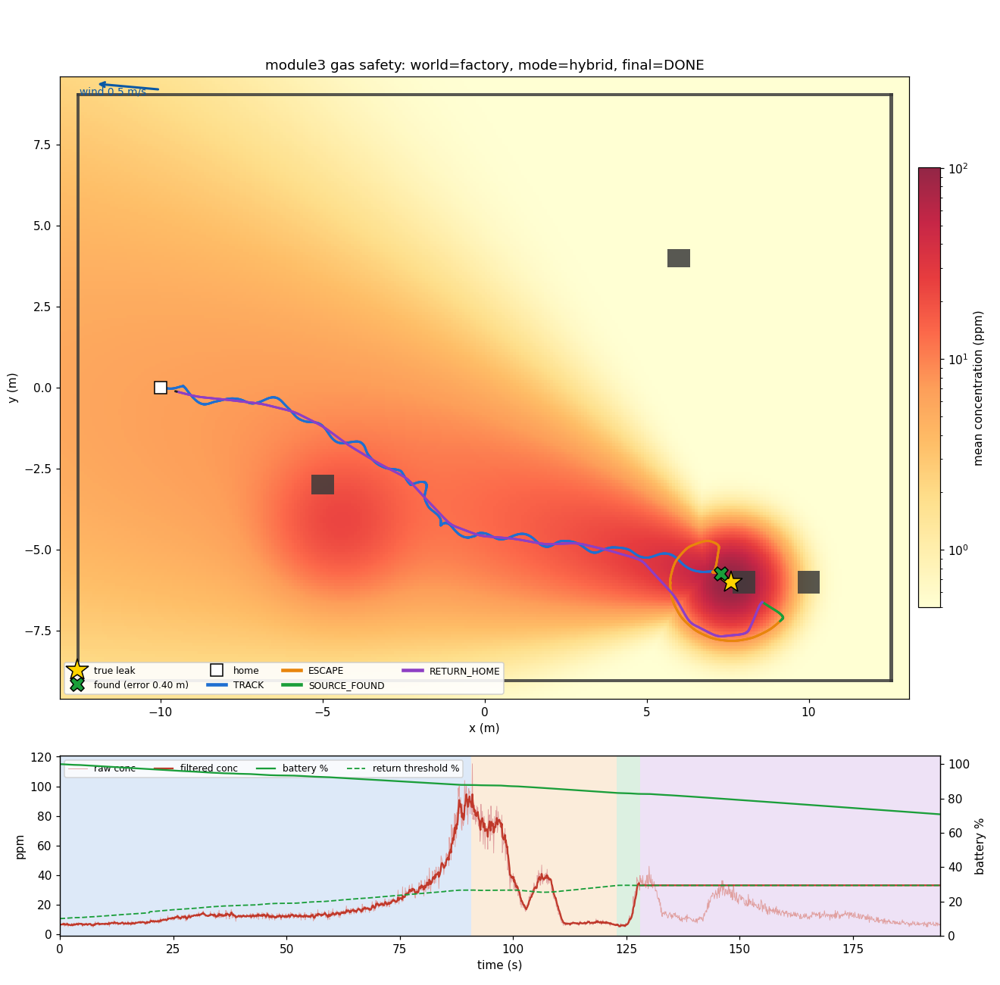
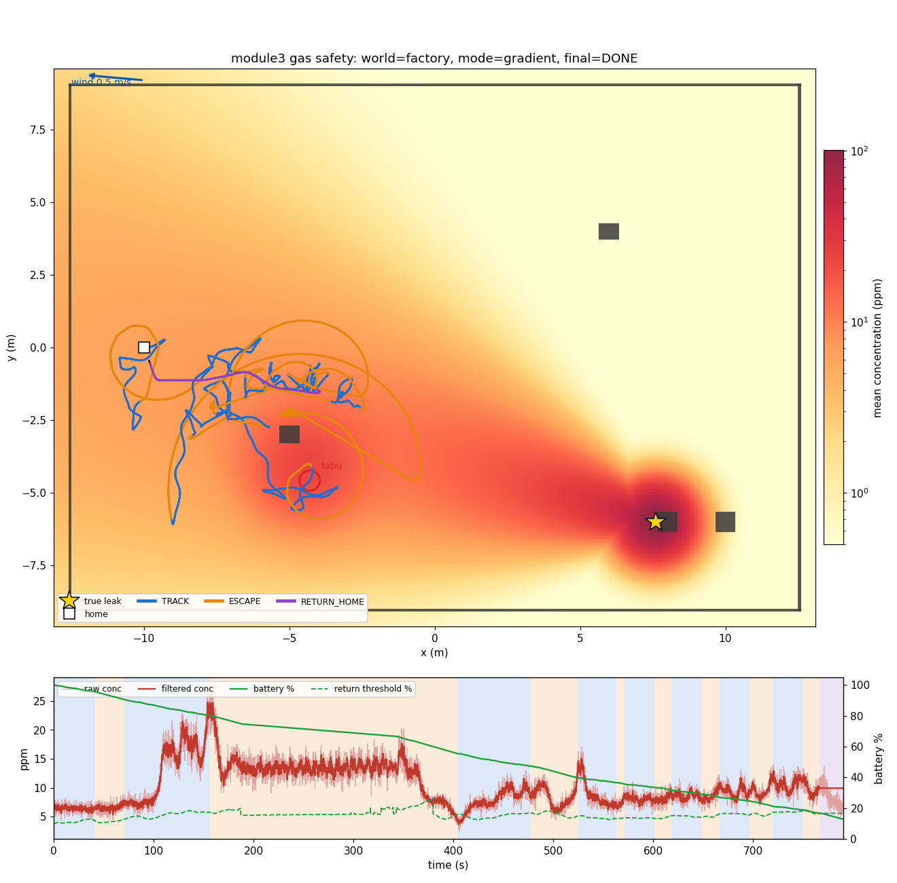
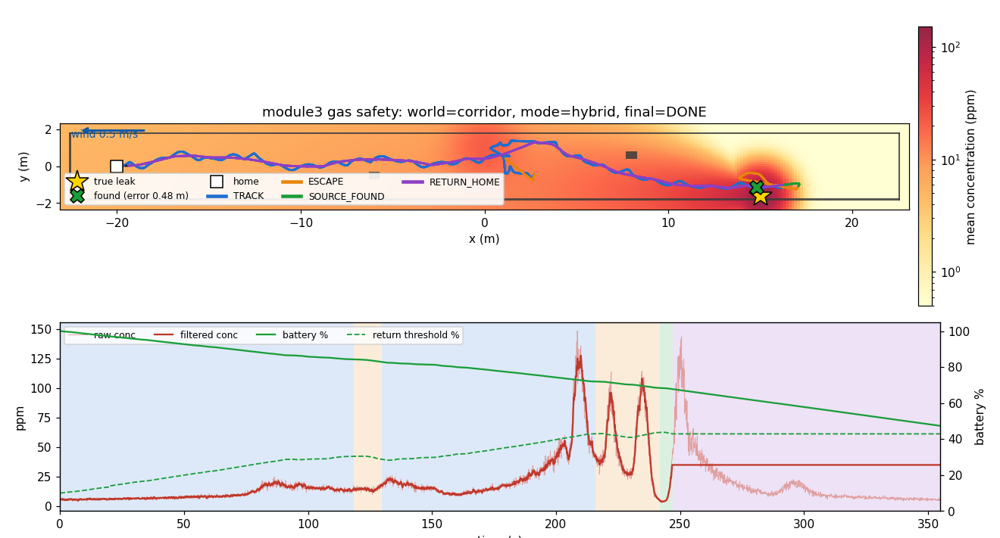

# module3_gas_safety

담당: **채현**

가스 안전: 플룸, 소스 시킹, 복귀. 로봇이 **가스 누출원을 스스로 찾아가고**, 바람·장애물 때문에 생기는 **가짜 봉우리(local optimum)** 에서 빠져나오며, 배터리 등이 위험해지면 **홈으로 복귀**한다.

| 패키지 | 노드 | 역할 |
|--------|------|------|
| `plume_sim` | `plume_sim_node` | 가우시안 플룸 + 정체 구역(decoy) 농도장. `/odom` 위치에서 샘플링해 `/gas/concentration`, `/gas/wind` 발행 |
| `source_seeking` | `source_seeking_node` | 탐색 상태 머신: 탐색 → 추적 → local optimum 감지 → 나선 탈출 → 누출원 판정. `/source_seeking/goal` 발행 |
| `return_to_home` | `return_to_home_node`, `battery_sim_node` | 복귀 규칙(배터리·거리·시간·위험 농도·임무 종료) + 지나온 지점 그래프 최단 경로 복귀. 가상 배터리 `/battery` |

## 실행

```bash
# 통합 (가제보 + 모듈 1·2·3)
ros2 launch simulation full_system.launch.py world:=factory

# 모듈 3만 (가제보·브리지가 떠 있을 때)
ros2 launch plume_sim plume_sim.launch.py world:=factory
ros2 launch return_to_home return_to_home.launch.py world:=factory            # battery:=30.0
ros2 launch source_seeking source_seeking.launch.py world:=factory            # mode:=gradient, log_file:=/tmp/gas_run

# mpc_controller 없이 모듈 3이 직접 /cmd_vel로 주행 (단독 시험)
ros2 launch return_to_home return_to_home.launch.py world:=factory drive_mode:=cmd_vel
ros2 launch source_seeking source_seeking.launch.py world:=factory drive_mode:=cmd_vel

# 상태 확인 / 복귀 시험
ros2 topic echo /source_seeking/state
ros2 topic echo /return_to_home/status
ros2 param set /battery_sim percent 20.0
```

Gazebo 없이 전체 로직(플룸 + 탐색 + 배터리 + 복귀)을 2D로 검증하는 오프라인 시뮬레이터:

```bash
ros2 run source_seeking offline_sim --world factory                   # -> offline_run.csv/.json/.png
ros2 run source_seeking offline_sim --world factory --mode gradient   # 구배만: 가짜 봉우리에 갇힘
ros2 run source_seeking offline_sim --world factory --battery 25      # 배터리 부족 복귀
ros2 run source_seeking plot_run /tmp/gas_run --world factory         # 노드 로그(log_file) 그림
```

테스트: 각 패키지 디렉터리에서 `python -m pytest test/ -q -p no:launch_testing -p no:launch_ros`

## 토픽

| 토픽 | 타입 | 발행 → 구독 |
|------|------|-------------|
| `/gas/concentration` | `std_msgs/Float32` (ppm) | plume_sim → source_seeking, return_to_home, 관제 |
| `/gas/wind` | `geometry_msgs/Vector3Stamped` (월드 좌표 m/s) | plume_sim → source_seeking |
| `/gas/field`, `/gas/markers` | `OccupancyGrid`, `MarkerArray` | plume_sim → RViz (농도 지도, 실제 누출원) |
| `/battery` | `sensor_msgs/BatteryState` (0..1) | battery_sim → return_to_home |
| `/source_seeking/goal` | `geometry_msgs/PoseStamped` | source_seeking → (goal 선택기) → mpc_controller |
| `/source_seeking/state` | `std_msgs/String` `"상태 \| 이유 \| 농도"` | source_seeking → return_to_home, 관제 |
| `/source_seeking/source` | `geometry_msgs/PointStamped` | source_seeking → 관제 (누출원 추정 위치) |
| `/return_to_home/goal` | `geometry_msgs/PoseStamped` | return_to_home → (goal 선택기) → mpc_controller |
| `/return_to_home/status` | `std_msgs/String` `"IDLE\|RETURNING\|HOME \| 이유 \| 배터리/기준 \| 집까지"` | return_to_home → source_seeking, 관제 |
| `/mission/status` | `std_msgs/String` | return_to_home → 상태 전환 알림. `"return_home"`이 들어오면 복귀 시작 |

> **통합 시 필요한 것**: 지금 `mpc_controller`는 `goal_topic` 하나(`/patrol/goal`)만 따른다. 순찰 중 가스 감지 → `/source_seeking/goal`, 복귀 중 → `/return_to_home/goal`로 바꿔 주는 **goal 선택기(mux)** 가 필요하다(모듈 1·2와 협의). 그전까지는 `drive_mode:=cmd_vel`로 모듈 3 단독 시험을 하거나, `mpc_controller`의 `goal_topic` 파라미터를 `/source_seeking/goal`로 바꿔 쓴다.

## 알고리즘

### 상태 머신 (`source_seeking/seeker.py`)

```
            ┌──── 배터리 / 거리 / 시간 / 위험 농도 (return_to_home, 모든 상태에서 우선) ────→ RETURNING → HOME
            │
 SEARCH ──(가스 감지)──→ TRACK ──(빙빙 돎 / 개선 없음 / 지나침)──→ ESCAPE (Archimedean spiral)
   ↑                     ↑   └──(가스 놓침)──→ ESCAPE(lost)            │
   │                     └────── 멀리서 더 높은 농도 (기존 봉우리 tabu) ─┤
   └────── 나선 끝, 봉우리 < 40 ppm (가짜 봉우리 → tabu) ─────────────────┤
                         나선 끝, 봉우리 ≥ 40 ppm ────────────────────────→ SOURCE_FOUND → (5 s 뒤) 복귀
```

- **TRACK 방향** = 바람 반대 방향(`hybrid` 모드) + 농도 구배 + tabu·막힌 지점 반발력. 구배는 최근 6 s 샘플에 평면 `c = a + g·p`를 최소제곱으로 맞춰 구하고, 진행 방향을 ±0.6 rad 사인파로 흔들어(weave) 측면 구배도 잰다.
- **"지금 방향이 맞는가?"** (local optimum 감지): 30 s 동안 반경 1.2 m 안에서 맴돎 / 40 s 동안 최고 농도 개선 없음(단, 4 m 이상 이동 중이면 평평한 원거리 플룸이라 제외) / 강한 봉우리(≥40 ppm)를 지나 농도가 절반 아래로 3 s.
- **나선 탈출**: 갇힌 지점 중심 `r = r0 + pitch·θ/2π` (pitch 2 m, 최대 5 m). 기준 = 갇힌 지점 최근 6 s **평균** 농도(노이즈 섞인 최대값은 기준을 부풀림). 기준보다 8% 높은 상태가 **1.5 s 이어지면** 탈출 성공. 새 지점이 tabu 반경(3 m) 밖이면 옛 봉우리를 tabu로 기록. 가까우면 같은 언덕이라 기록하지 않는다(진짜 누출원 옆을 tabu로 찍으면 반발력이 로봇을 밀어낸다).
- **누출원 판정**: 봉우리가 이미 강하면(≥40 ppm) 반경 2.5 m 확인 나선만 돌고, 더 높은 곳이 없으면 SOURCE_FOUND.
- **막힘**: 목표에 도착하지 않았는데 3 s 동안 위치 0.1 m·방향 0.15 rad도 안 변함 → TRACK이면 옆으로 1.2 m 비켜서기, 나선이면 그 경유점 포기, 복귀면 경로 재계획. 주행 영역(`bounds`) 밖 경유점은 처음부터 건너뛴다.

### 복귀 규칙 (`return_to_home/home_path.py`)

```
복귀 기준(%) = return_safety_factor × 집까지_경로(m) × 소모율(%/m) + battery_reserve
             = 1.5 × d_home × 0.5 + 10          배터리 ≤ 기준 → 복귀
```

- `d_home`은 직선거리가 아니라 **지나온 지점 그래프**(1 m 간격 breadcrumb, 1.8 m 이내끼리 연결)의 **Dijkstra 최단 경로 길이**. 실제로 걸어 본 곳만 이으므로 지도 없이도 안전하다. 예: 집까지 20 m → 25% 이하에서 복귀, 6 m → 14.5%.
- 소모율은 사전값(0.5 %/m)과 실측(보행+대기 포함) 중 큰 값.
- 그 밖에 최대 거리 50 m, 임무 시간 1200 s, 위험 농도(`danger_conc`, 기본 꺼짐), 누출원 발견 5 s 후, 탐색 영역 소진, `/mission/status`의 `return_home` 요청.
- 복귀 중 막히면: 지름길 간선이면 지우고 재계획, 걸어 본 간선이면 좌우로 비켜선 뒤 재시도.

### 플룸 (`plume_sim/plume.py`, `config/plume_<world>.yaml`)

시간 평균 2D 가우시안 플룸 + 정체 구역. Gazebo에는 가스 시뮬레이션이 없어 모델로 대체했다.

| 월드 | 누출원 | 바람 | 정체 구역(가짜 봉우리) |
|------|--------|------|------------------------|
| factory | gas_tank_1 서쪽 밸브 (7.6, -6.0), 100 ppm | 0.5 m/s, 홈 쪽(2.85 rad) | rack_b 뒤 (-4.5, -4.2), 15 ppm |
| corridor | 남쪽 벽 배관 (15, -1.6), 150 ppm | 0.5 m/s, -x | 북쪽 벽 (0, 1.2), 12 ppm |

센서 노이즈: 비례 10% + 0.3 ppm, 풍향 0.15 rad. 실제 플룸은 난류로 간헐적이라 이보다 어렵다. 더 현실적인 실험은 [GADEN](https://github.com/MAPIRlab/gaden)으로 `plume_sim`을 바꾸면 된다(토픽만 맞추면 나머지는 그대로).

## 결과 (오프라인 시뮬레이터, 노이즈 seed 20개)

| 월드 | 모드 | 누출원 판정 | 판정 시간 (s) | 위치 오차 (m) | 홈 복귀 |
|------|------|------------|---------------|---------------|---------|
| factory | hybrid (바람+구배) | **20/20** | 111–275 (평균 132) | 0.30–0.58 | 20/20 |
| factory | gradient (구배만) | 2/20 | 447–463 | 0.35–0.72 | 20/20 |
| corridor | hybrid | **19/20** | 160–427 (평균 234) | 0.32–0.83 | 20/20 |
| corridor | gradient | 3/20 | 375–410 | 0.65–1.83 | 20/20 |

- 구배만 따라가면 정체 구역(가짜 봉우리)에 갇힌다. 나선으로 빠져나와 tabu로 기록하지만 그 사이 배터리가 복귀 기준에 걸린다. 바람 정보를 더한 hybrid는 대부분 바로 누출원으로 간다.
- 80회 모두 배터리가 바닥나기 전에 홈으로 돌아왔다. 누출원 오차는 탱크 반경(0.35 m)과 로봇 반경 때문에 0.3 m 아래로 내려가지 않는다.
- ROS 노드(`drive_mode:=cmd_vel`)를 운동학 로봇으로 돌린 결과: factory 누출원 오차 0.41 m, 홈 복귀 배터리 71.3% / corridor 0.41 m, 52.8% / factory 배터리 25% 시작 → 18.5%에서 복귀(집까지 9.6 m), 13.3% 남기고 도착.

| factory hybrid | factory gradient (가짜 봉우리) |
|---|---|
|  |  |
| **corridor hybrid** (누출원 지나침 → 되돌아와 확인) | **factory 배터리 25% 시작** (복귀 기준 발동) |
|  |  |
